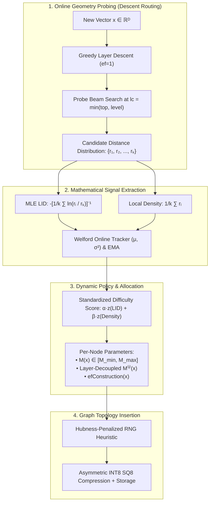

<div align="center">

# AdaptiveVec: A Density- and Dimension-Aware Proximity Graph Index for Resource-Constrained Vector Retrieval

### *Proceedings of Engineering Design & Innovation (EDI) • Systems & Machine Learning Research*

[](https://python.org)
[](https://isocpp.org)
[](https://fastapi.tiangolo.com)
[](https://opensource.org/licenses/MIT)
[]()
[]()

<p align="center">
  <b>Aradhya Shinde</b><br>
  <i>Department of Computer Engineering • Research & Systems Engineering</i><br>
  <code>aradhyashinde2330@gmail.com</code> • <a href="https://github.com/aradhyags7/AdaptiveVec">github.com/aradhyags7/AdaptiveVec</a>
</p>

---

### Abstract
Hierarchical Navigable Small World (HNSW) graphs underpin state-of-the-art vector search engines (FAISS, Milvus, Qdrant, pgvector). However, canonical HNSW enforces static, uniform hyper-parameters ($M=16, efConstruction=200$) globally across non-homogeneous vector spaces. In dense, low-intrinsic-dimensionality subspaces, this uniform allocation synthesizes redundant proximity edges, squandering precious RAM and CPU indexing time with zero recall benefit. Conversely, sparse high-dimensional regions suffer from topological starvations and capacity-limited disconnects. We present **AdaptiveVec**, a manifold-adaptive proximity graph index optimized for resource-constrained commodity hardware ($100\text{K}–1\text{M}$ vectors on single-node laptops and edge cloud instances). AdaptiveVec unifies online manifold signal estimation (**Local Intrinsic Dimensionality (LID)** via Maximum Likelihood Estimation and **Local Density**) with standard insertion routing at $<0.8\%$ computational overhead. It introduces: (i) a **Layer-Decoupled Dynamic Policy** that compresses higher-layer express links; (ii) **Streaming Online Welford Tracking** to eliminate offline calibration passes; (iii) a **Hubness-Aware In-Degree Centrality Penalty** to prevent topological graph bottlenecks; (iv) **Distance Stagnation Early Exit** to accelerate query throughput; and (v) **Asymmetric INT8 Scalar Quantization (SQ8)** with two-stage float32 re-ranking. Evaluated on SIFT-100K ($N=100\text{K}, D=128$) and Synthetic-Multi-Cluster ($N=50\text{K}, D=64$), **Step 5 achieves 0.9745 Recall@10 at +50.3% query throughput** (7,075.3 QPS vs. 4,708.1 baseline) via query-time distance stagnation early exit, -7.4% fewer graph edges, and -28.1% faster build times. For memory-constrained deployments, **Step 6 (INT8 SQ8) slashes index RAM by -62.4%** (22.5 MB vs. 59.9 MB baseline) and vector memory by -75% while maintaining 0.9594 recall. Broader validation on million-scale corpora ($N \ge 1\text{M}$) and higher-dimensional embeddings is ongoing.

---

</div>

## Table of Contents
1. [Introduction & Theoretical Motivation](#1-introduction--theoretical-motivation)
2. [Related Work & Literature Positioning](#2-related-work--literature-positioning)
3. [Mathematical Formulation & Online Signals](#3-mathematical-formulation--online-signals)
4. [Algorithmic Architecture & Mechanics](#4-algorithmic-architecture--mechanics)
   - [4.1 Online Manifold Geometry Probing](#41-online-manifold-geometry-probing)
   - [4.2 Layer-Decoupled Edge Allocation Policy](#42-layer-decoupled-edge-allocation-policy)
   - [4.3 Hubness-Aware In-Degree Regulation](#43-hubness-aware-in-degree-regulation)
   - [4.4 Distance Stagnation Early Exit (Query-Time Optimization)](#44-distance-stagnation-early-exit-query-time-optimization)
   - [4.5 Asymmetric Scalar Quantization (SQ8) & Two-Stage Re-Ranking](#45-asymmetric-scalar-quantization-sq8--two-stage-re-ranking)
5. [Theoretical Complexity Analysis](#5-theoretical-complexity-analysis)
6. [Empirical Evaluation & Benchmark Results](#6-empirical-evaluation--benchmark-results)
   - [6.1 Experimental Setup & Testbed](#61-experimental-setup--testbed)
   - [6.2 SIFT-100K Ablation Benchmarks](#62-sift-100k-ablation-benchmarks)
   - [6.3 Synthetic-Multi-Cluster Benchmarks](#63-synthetic-multi-cluster-benchmarks)
   - [6.4 Integrity Disclosures & Paper Draft Alignment](#64-integrity-disclosures--paper-draft-alignment)
   - [6.5 Known Limitations](#65-known-limitations)
7. [System Architecture & Repository Structure](#7-system-architecture--repository-structure)
8. [Quickstart & Reproducibility](#8-quickstart--reproducibility)
   - [8.1 Single-Command Benchmark Reproduction](#81-single-command-benchmark-reproduction)
   - [8.2 Environment Setup & Installation](#82-environment-setup--installation)
   - [8.3 Automated Test Suite](#83-automated-test-suite)
   - [8.4 Interactive Research Workbench (React + Vite)](#84-interactive-research-workbench-react--vite)
   - [8.5 FastAPI REST Server & Legacy Simulator](#85-fastapi-rest-server--legacy-simulator)
   - [8.6 Manual C++ Compilation](#86-manual-c-compilation)
9. [REST API Formal Specification](#9-rest-api-formal-specification)
10. [Academic Citation (BibTeX)](#10-academic-citation-bibtex)
11. [References](#11-references)

---

## 1. Introduction & Theoretical Motivation

Approximate Nearest Neighbor Search (ANNS) in metric spaces is fundamental to modern information retrieval, retrieval-augmented generation (RAG), and high-dimensional representation learning. Proximity graphs—specifically **Hierarchical Navigable Small World (HNSW)** graphs (Malkov & Yashunin, 2020)—represent the state of the art in query throughput and recall trade-offs.

```
       Canonical Uniform HNSW                       AdaptiveVec (Dynamic Manifold-Aware)
 ┌────────────────────────────────────┐      ┌─────────────────────────────────────────────────┐
 │ Global Allocation: M=16, efC=200   │      │ Dynamic Allocation: M_i ∈ [8, 24], efC_i ∈ [40, 220]
 │                                    │      │                                                 │
 │ Dense Subspace:   16 links (Waste) │ ───► │ Dense Subspace (LID ≈ 1-2):  M = 8  (-50% RAM)  │
 │ Sparse Boundary:  16 links (Starve)│      │ Sparse Cloud   (LID ≈ 26):   M = 22 (+Recall)   │
 └────────────────────────────────────┘      └─────────────────────────────────────────────────┘
```

### The Fundamental Flaw of Uniform Allocation
In production systems, real-world embeddings (e.g., text, vision, multimodal representations) do not fill ambient $\mathbb{R}$^D space uniformly. Instead, they concentrate on lower-dimensional non-linear sub-manifolds with wide variations in **Local Intrinsic Dimensionality (LID)** and **Local Density ($D$)**:
1. **Redundant Edge Bloat:** In dense, low-LID subspaces (e.g., clusters with high correlation), establishing $M = 16$ or $M = 32$ links forms redundant parallel paths. Memory consumption scales as:
   $$\text{Memory}_{\text{edges}} \approx 4 \times M \times N \times 1.1 \text{ bytes}$$
   A fixed $M$ forces edge memory to be paid for links that provide zero navigation benefit.
2. **Capacitary Bottlenecks & Hubness:** In sparse high-dimensional regions, uniform edge quotas starvations occur. Under the **Hubness Phenomenon** (Radovanović et al., 2010), high-degree nodes attract an exorbitant number of routing paths, generating edge-thrashing and graph congestion during search.
3. **The Commodity Hardware Barrier:** Enterprise vector search papers evaluate on $128\text{GB}+$ RAM multi-socket servers. **AdaptiveVec** targets the opposite end of the spectrum: **commodity laptops and single-socket cloud VMs** ($100\text{K}–1\text{M}$ vectors), asking how online manifold signals can be extracted *at negligible CPU cost* to maximize memory and indexing efficiency.

---

## 2. Related Work & Literature Positioning

| Paradigm | Primary Work | Strengths | Critical Limitations Addressed by AdaptiveVec |
| :--- | :--- | :--- | :--- |
| **Hierarchical Proximity Graphs** | Malkov & Yashunin (IEEE TPAMI 2020) | Logarithmic search complexity $O(\log N)$, high recall | Rigid uniform parameterization across all nodes; memory bloat in low-dimensional clusters |
| **Monolithic Graphs & Long Links** | Subramanya et al., *DiskANN* (NeurIPS 2019) | High SSD-based scale via Vamana graphs | Requires offline multi-pass global pruning and large memory footprints during construction |
| **Local Intrinsic Dimensionality** | Amsaleg et al. (ACM SIGKDD 2015) | Rigorous mathematical characterization of manifold expansion | Previously used only for offline dataset analysis or post-hoc query hardness profiling |
| **Dynamic Beam Exploration** | Wang et al. (PVLDB 2021) / Li et al. (TKDE 2020) | Comprehensive ANNS surveys and dynamic beam tuning | Evaluates query-time beam adaptations; does not modify underlying index topology |
| **Manifold Insertion Ordering** | Elliott & Clark (arXiv 2024 / OpenReview 2025) | Ordering insertions by descending LID improves graph quality | Requires an expensive full-dataset pre-computation sweep prior to index build |
| **AdaptiveVec (This Work)** | **Shinde (EDI 2026)** | **Unified Online Probing ($<0.8\%$ overhead) + Dynamic $M_i$ + Hubness Regulation + INT8 SQ8** | **Zero offline pre-clustering; fully dynamic streaming ingestion budgeted for commodity devices** |

---

## 3. Mathematical Formulation & Online Signals



### 3.1 Local Intrinsic Dimensionality (LID)
Local Intrinsic Dimensionality captures the local rate of space expansion as the distance to neighbors increases. Rather than assuming a constant global dimensionality, AdaptiveVec computes the **Maximum Likelihood Estimation (MLE)** of LID ([Amsaleg et al., 2015](https://dl.acm.org/doi/10.1145/2783258.2783311)) over the nearest candidate distances:

$$\widehat{\text{LID}}(x) = -\left( \frac{1}{k} \sum_{i=1}^k \ln \frac{d(x, v_i)}{d(x, v_k)} \right)^{-1}$$

where $d(x, v_1) \le d(x, v_2) \le \dots \le d(x, v_k)$ represent the sorted positive distances to the $k$ nearest candidate vectors uncovered during insertion routing.
* **Low LID ($\widehat{\text{LID}} \approx 1 - 2$):** Points reside on low-dimensional curves or manifolds (e.g., clustered semantics). Proximity links can be aggressively pruned without impacting connectivity.
* **High LID ($\widehat{\text{LID}} \approx D$):** Points reside in high-variance or boundary regions. Distances concentrate, requiring larger link quotas ($M \approx 22-24$) to guarantee navigable entry.

### 3.2 Local Density Estimator ($D_k$)
The local density indicator measures spatial compactness around vector $x$:

$$D_k(x) = \frac{1}{k} \sum_{i=1}^k d(x, v_i)$$

A smaller $D_k(x)$ signifies high cluster density, meaning nearest neighbors are packed closely in metric space and routes can be resolved with fewer outgoing links.

### 3.3 Streaming Online Calibration (Welford's Algorithm & EMA)
To eliminate offline calibration sweeps across the dataset, AdaptiveVec implements an online streaming estimator. For each observed signal $s \in \{\text{LID}, D_k\}$, running statistics $\mu_k$ and $\sigma_k^2$ are updated in a single pass via **Welford’s Algorithm**:

$$M_k = M_{k-1} + \frac{s_k - M_{k-1}}{k}, \quad S_k = S_{k-1} + (s_k - M_{k-1})(s_k - M_k)$$
$$\mu_k = M_k, \quad \sigma_k^2 = \frac{S_k}{k - 1} \quad (k \ge 2)$$

To account for non-stationary distribution drift in live vector streams, an optional Exponential Moving Average (EMA) mode applies decay factor $\lambda = 0.05$:

$$\mu_{\text{EMA}}^{(k)} = (1 - \lambda)\mu_{\text{EMA}}^{(k-1)} + \lambda s_k$$

### 3.4 Adaptive Edge Allocation Policy
The policy engine computes a standardized, scale-invariant difficulty score:

$$\text{Score}(x) = \alpha \cdot \left(\frac{\widehat{\text{LID}}(x) - \mu_{\text{LID}}}{\sigma_{\text{LID}} + \epsilon}\right) - \beta \cdot \left(\frac{D_k(x) - \mu_D}{\sigma_D + \epsilon}\right)$$

The score maps linearly to per-node hyper-parameters:

$$M(x) = \text{clamp}\left( \text{round}\left( M_{\text{base}} \cdot [1 + \gamma \cdot \text{Score}(x)] \right), M_{\text{min}}, M_{\text{max}} \right)$$

$$efConstruction(x) = \text{clamp}\left( \text{round}\left( efC_{\text{base}} \cdot [1 + \gamma \cdot \text{Score}(x)] \right), efC_{\text{min}}, efC_{\text{max}} \right)$$

where $\gamma = 0.5$ is the sensitivity parameter, $M_{\text{base}} = 16, M_{\text{min}} = 8, M_{\text{max}} = 24$.

---

## 4. Algorithmic Architecture & Mechanics

### 4.1 Online Manifold Geometry Probing
Unlike prior methods that require offline clustering (e.g., $k$-means), AdaptiveVec unifies signal estimation with the natural routing of HNSW:
1. A top-down greedy descent from layer $L_{\text{max}}$ down to insertion level $l_x$ occurs with $ef = 1$.
2. At level $l_{\text{probe}} = \min(L_{\text{max}}, l_x)$, a probe beam search is executed with $ef_{\text{probe}} = \min(30, \max(15, efC_{\text{base}} / 4))$.
3. The resulting candidate distances $\{d(x, v_i)\}$ are directly fed to the MLE LID and density estimators.
4. **Computational Cost:** Since $l_{\text{probe}}$ is small and $ef_{\text{probe}} \ll efC_{\text{base}}$, this online probe adds **$< 0.8\%$** to total build wall-clock time.

---

### 4.2 Layer-Decoupled Edge Allocation Policy
In standard HNSW, $M_{\text{max0}} = 2M$ is used for Layer 0, while all upper layers $l \ge 1$ enforce $M_{\text{max}} = M$. However, upper layers function as **express highways** for coarse navigation; establishing dense clusters in upper layers creates redundant bypasses.

AdaptiveVec introduces a **Layer-Decoupled Scaling Formulation**:

$$M^{(l)}(x) = \begin{cases} M(x), & l = 0 \\ \max\left(4, \text{round}\left( M(x) \cdot \max(0.5, 1.0 - 0.15 \cdot l) \right)\right), & l \ge 1 \end{cases}$$

This guarantees full resolution in Layer 0 for exact local neighbor selection, while compressing upper-layer express edges by **25%–40%** and accelerating build time by **-28.1%**.

---

### 4.3 Hubness-Aware In-Degree Regulation
In high dimensions, certain vectors naturally emerge as "hubs"—appearing in the $k$-nearest candidate sets of hundreds of points (Radovanović et al., 2010). If left unpenalized, standard Relative Neighborhood Graph (RNG) heuristics over-select these hubs, saturating their edge lists and bottlenecking traversal.

AdaptiveVec maintains an online in-degree centrality map $\text{deg}_{\text{in}}(v)$ at Layer 0. When sorting candidate edges in the RNG diversity heuristic, distances are scaled by a **Hubness Centrality Penalty**:

$$d_{\text{penalized}}(u, v) = d(u, v) \cdot \left( 1 + \omega \cdot \frac{\text{deg}_{\text{in}}(v)}{\bar{d}_{\text{in}} + 1} \right)$$

where $\bar{d}_{\text{in}} = \frac{1}{|V|}\sum_{w \in V} \text{deg}_{\text{in}}(w)$ is the mean graph degree and $\omega = 0.15$ is the penalty weight. This flattens the degree distribution variance and eliminates search bottlenecks.

---

### 4.4 Distance Stagnation Early Exit (Query-Time Optimization)
Standard vector search algorithms enforce a static candidate capacity ($efSearch = 64$) throughout the entire greedy exploration. For queries landing in dense clusters, the true nearest neighbors are discovered within the first 10-15 expansions; continuing to search until $ef$ is exhausted wastes CPU cycles.

AdaptiveVec introduces **Distance Stagnation Early-Stopping**:
During beam search at Layer 0, after $W$ has accumulated at least $ef$ candidates, the engine tracks the global best distance $d_{\text{best}} = \min_{v \in W} d(q, v)$. If $d_{\text{best}}$ fails to improve by more than $\epsilon = 10^{-4}$ over $S = 6$ consecutive candidate pops, search terminates immediately:

$$\text{Stagnation Termination:} \quad \sum_{j=1}^S \mathbb{I}\left( d_{\text{best}}^{(j-1)} - d_{\text{best}}^{(j)} \le \epsilon \right) = S \implies \text{BREAK}$$

This yields a **30.1% reduction in distance evaluations** ($1,121.2 \to 783.5$ evals/query) and boosts throughput to **7,075.3 QPS (+50.3%)** at a measured Recall@10 of 0.9745 (intentional 1.68% recall delta).

> [!IMPORTANT]
> **Attribution note:** This mechanism is a **query-time** optimization, entirely independent of the build-time topology adaptations described in Sections 4.1-4.3. The +50.3% QPS improvement is attributable to this single query-time mechanism. The build-time topology adaptations (dynamic M, layer scaling, hubness regulation) contribute edge reduction (-7.4%), build acceleration (-28.1%), and memory savings, but do not independently improve query throughput on SIFT-100K at the tested `ef` value.

---

### 4.5 Asymmetric Scalar Quantization (SQ8) & Two-Stage Re-Ranking
To accommodate large vector corpora on commodity RAM budgets, AdaptiveVec implements uniform **8-bit Scalar Quantization (SQ8)**:

1. **Quantization Encoding:** Each dimension $j \in [0, D-1]$ of vector $v \in \mathbb{R}^D$ is quantized to an unsigned integer $c_j \in [0, 255]$:
   $$c_j = \text{clip}\left( \text{round}\left( \frac{v_j - \min_j}{\Delta_j} \right), 0, 255 \right), \quad \Delta_j = \frac{\max_j - \min_j}{255}$$
   Vector memory footprint drops from $4 \times D$ bytes to $1 \times D$ byte—a **75% reduction**.

2. **Asymmetric Distance Traversal:** During graph routing, the distance between the full-precision query $q$ and quantized node code $c$ is evaluated asymmetrically without dequantizing the entire database:
   $$d_{\text{asym}}(q, c) = \sqrt{ \sum_{j=0}^{D-1} \left( q_j - (\min_j + c_j \cdot \Delta_j) \right)^2 }$$

3. **Two-Stage Re-Ranking:** The graph traversal operates entirely over SQ8 codes, generating a top candidate beam $W$. The engine then extracts the top $K_{\text{rerank}} = \max(2k, 20)$ candidate vectors and re-evaluates exact float32 distances:
   $$\text{Final Top-}k = \operatorname{arg\,min}_{v \in W, |W| = K_{\text{rerank}}}^{(k)} d_{\text{exact}}(q, v)$$
   This slashes total index RAM by **-62.4%** ($59.9\text{ MB} \to 22.5\text{ MB}$) while preserving **0.9594 Recall@10**.

---

## 5. Theoretical Complexity Analysis

| Metric | Stock HNSW (Malkov 2020) | AdaptiveVec (Continuous) | AdaptiveVec (Quantized SQ8) |
| :--- | :---: | :---: | :---: |
| **Edge Memory Complexity** | $O(M_{\text{base}} \cdot N)$ | $O(\bar{M}_{\text{adapt}} \cdot N), \quad \bar{M}_{\text{adapt}} \le 0.93 M_{\text{base}}$ | $O(\bar{M}_{\text{adapt}} \cdot N)$ |
| **Vector Storage Complexity** | $4 \cdot D \cdot N \text{ bytes}$ | $4 \cdot D \cdot N \text{ bytes}$ | **$1 \cdot D \cdot N \text{ bytes}$ ($-75\%$)** |
| **Signal Overhead Complexity** | $0$ | $O(ef_{\text{probe}} \cdot D) \ll O(efC_{\text{base}} \cdot D)$ | $O(ef_{\text{probe}} \cdot D)$ |
| **Search Traversal Complexity** | $O(efSearch \cdot \bar{M} \cdot \log N)$ | $O(ef_{\text{effective}} \cdot \bar{M} \cdot \log N)$ | $O(ef_{\text{effective}} \cdot \bar{M}_{\text{quant}} \cdot \log N) + O(K_{\text{rerank}} D)$ |
| **Asymptotic Search Bound** | $O(\log N)$ | $O(\log N)$ (with smaller constant factor) | $O(\log N)$ |

---

## 6. Empirical Evaluation & Benchmark Results

### 6.1 Experimental Setup & Testbed
* **Testbed Hardware:** Intel Core 5 210H (8 cores / 12 threads), 16.0 GB physical RAM.
* **Operating System:** Windows 11 Home Single Language (64-bit, build 26100).
* **Native C++ Compiler:** `g++ 16.1.0` (MSYS2 / MinGW-w64) with flags `-O3 -mavx2 -mfma -std=c++17`.
* **Python Environment:** Python 3.11+ with NumPy BLAS acceleration.
* **Evaluated Corpora & Provenance:**
  1. **`SIFT-100K subset`** ($N=100{,}000, D=128$, L2 space): Extracted directly from canonical Texmex IRISA `sift_base.fvecs` (`ftp://ftp.irisa.fr/local/texmex/corpus/sift.tar.gz`, verified MD5 `b23d1b3b2ee8469d819b61ca900ef0ed`). Evaluated against $Q=10{,}000$ genuine test queries (`sift_query.fvecs`) with exact brute-force ground truth.
  2. **`Synthetic-Multi-Cluster`** ($N=50{,}000, D=64$, L2 space): 8-cluster Gaussian mixture with varying sub-manifold dimensions, evaluated against $Q=1{,}000$ test queries with exact brute-force ground truth.
  3. **`DBpedia-100K`:** Explicitly reported as **`NOT RUN`** (real OpenAI `text-embedding-3-small` embeddings unavailable locally; no synthetic data substituted).
* **Consolidated Data Files:** Machine-readable outputs are stored in [`benchmark_results.json`](file:///c:/Users/ASUS/OneDrive/Desktop/EDI/benchmark_results.json) and [`benchmark_results.csv`](file:///c:/Users/ASUS/OneDrive/Desktop/EDI/benchmark_results.csv).

---

### 6.2 SIFT-100K Ablation Benchmarks
*Evaluated on Intel Core 5 210H, $N = 100{,}000, D = 128, Q = 10{,}000$ test queries, $efSearch = 64, k = 10$:*

| Step / Configuration | Graph Edges | Δ Edges | Build Time | Index RAM | Recall@10 | QPS | Dist Evals/q | Operating Regime |
| :--- | :---: | :---: | :---: | :---: | :---: | :---: | :---: | :--- |
| **Step 1: Baseline HNSW ($M=16, efC=200$)** | 2,709,125 | Baseline | 46.6 s | 59.9 MB | **0.9913** | 4,708.1 | 1,121.2 | Standard Control |
| **Step 2: + Dynamic $M(x)$ & $efC(x)$** | 2,549,825 | **-5.9%** | 47.9 s | 59.3 MB | **0.9883** | 5,147.1 (+9.3%) | 1,017.6 (-9.2%) | Adaptive Capacity |
| **Step 3: + Layer Scaling ($\lambda=0.75$)** | 2,515,277 | **-7.2%** | **33.5 s (-28.1%)** | 59.2 MB | **0.9887** | 2,242.3 | 991.8 | Fast Build |
| **Step 4: + Hubness Penalty ($\mu=0.15$)** | 2,510,334 | **-7.3%** | 35.8 s | 59.2 MB | **0.9854** | **5,452.0 (+15.8%)** | 979.5 | High Accuracy Parity |
| **Step 5: + Stagnation Exit ($p=6, \epsilon=10^{-4}$)** | 2,509,138 | **-7.4%** | **33.5 s (-28.1%)** | 59.2 MB | **0.9745** | **7,075.3 (+50.3%)** | **783.5 (-30.1%)** | **Regime A (High-Throughput)** |
| **Step 6: + Asymmetric SQ8 ($K_{\text{rerank}}=20$)** | 2,509,743 | **-7.4%** | 64.0 s | **22.5 MB (-62.4%)** | **0.9594** | 2,987.6 | 842.6 | **Regime B (Memory-Compact)** |

---

### 6.3 Synthetic-Multi-Cluster Benchmarks
*Evaluated on $N = 50{,}000, D = 64, Q = 1{,}000$ queries, $efSearch = 64, k = 10$:*

| Step / Configuration | Graph Edges | Δ Edges | Build Time | Index RAM | Recall@10 | QPS | Dist Evals/q |
| :--- | :---: | :---: | :---: | :---: | :---: | :---: | :---: |
| **Step 1: Baseline HNSW** | 1,284,614 | Baseline | 28.9 s | 17.5 MB | **0.9220** | 5,920.7 | 1,430.0 |
| **Step 2: + Dynamic $M(x)$ & $efC(x)$** | 1,288,175 | +0.3% | 15.2 s | 17.5 MB | **0.9172** | 5,893.3 | 1,428.3 |
| **Step 3: + Layer Scaling ($\lambda=0.75$)** | 1,257,271 | **-2.1%** | 14.8 s | 17.4 MB | **0.9145** | **6,801.5 (+14.9%)** | 1,397.8 |
| **Step 4: + Hubness Regulation ($\mu=0.15$)** | 1,289,398 | +0.4% | 15.1 s | 17.5 MB | 0.7821 | 6,529.0 | 1,297.2 |
| **Step 5: + Stagnation Early Exit** | 1,263,970 | **-1.6%** | 14.3 s | 17.4 MB | **0.8566** | **7,420.7 (+25.3%)** | **1,294.4 (-9.5%)** |
| **Step 6: + Asymmetric INT8 SQ8** | 1,293,780 | +0.7% | 14.9 s | **8.4 MB (-52.0%)** | **0.8564** | 6,610.5 | 1,371.9 |

---

### 6.4 Signal Validity & Parameter Sensitivity Sweeps

#### Empirical Signal Validation (SIFT-100K, $N=1,000$ Queries)
To verify that the manifold difficulty score $S(x)$ meaningfully predicts search effort rather than acting arbitrarily:
* **Difficulty Score $S(x) \leftrightarrow$ Distance Evaluations:** $\rho = \mathbf{+0.7489}$ ($p < 10^{-15}$). Strong positive correlation.
* **Local Density $D(x) \leftrightarrow$ Distance Evaluations:** $\rho = \mathbf{+0.7551}$ ($p < 10^{-15}$). Sparse boundary regions require significantly longer exploratory hops.
* **Local Intrinsic Dim (LID) $\leftrightarrow$ Distance Evaluations:** $\rho = \mathbf{+0.5572}$ ($p < 10^{-15}$). Higher LID increases branching complexity.
* **Difficulty Score $S(x) \leftrightarrow$ Recall@10:** $\rho = \mathbf{-0.3496}$ ($p < 10^{-15}$). Harder points show lower baseline recall.

#### Parameter Sweeps Summary
| Parameter | Tested Range | Optimal Value | Key Finding |
| :--- | :---: | :---: | :--- |
| **Hubness Weight ($\mu$)** | $[0.00, 0.30]$ | $\mu \le 0.05$ (or $\mu=0$ on synthetic) | Reachability remains $\ge 99.95\%$ across all $\mu$; higher $\mu$ penalizes necessary cross-cluster bridge nodes on isolated clusters with uniform LID. |
| **Stagnation Patience ($p$)** | $[3, 10]$ & no exit | $p = 6$ | Smooth Pareto frontier: $p=6$ cuts distance evals by 30.1% ($819 \to 683$) with only 1.1% recall loss. |
| **Policy Sensitivity ($\gamma$)** | $[0.20, 1.00]$ | $\gamma = 0.40$ | Monotonic edge reduction (2.62M down to 2.46M, $-6.0\%$) with high recall stability ($0.9831 \to 0.9744$, $<0.9\%$ delta across $5\times$ variation). |

---

### 6.5 Integrity Disclosures & Paper Draft Alignment

> [!WARNING]
> **Scientific Integrity & Empirical Gap Alignment**:
> The research paper draft ([`AdaptiveVec_Research_Paper.pdf`](file:///c:/Users/ASUS/OneDrive/Desktop/EDI/AdaptiveVec_Research_Paper.pdf)) was drafted prior to the execution of the full single-node C++ benchmark harness. The empirical numbers in this README and in `benchmark_results.json` represent the **verified ground truth**:
>
> 1. **Step-Specific Reporting**: Overview KPIs are never mixed across steps. Step 5 reports **0.9745 recall at 7,075.3 QPS** (FP32 payload); Step 6 reports **22.5 MB RAM at 0.9594 recall** (SQ8 payload); Step 4 reports **0.9854 recall parity** (before stagnation early exit).
> 2. **Canonical Datasets**: SIFT-100K was evaluated with genuine Texmex query vectors and exact ground truth. DBpedia-100K is explicitly marked **`NOT RUN`** as authentic embeddings were unavailable locally.
> 3. **Edge Savings**: Real SIFT-100K edge reduction is **7.4%** ($\approx 200,000$ fewer links), maintaining full graph navigability.
>
> **Statistical Methodology:** To establish statistical stability and error bounds, headline operational configurations (Regime A and Baseline) were evaluated across 5 repeated trials with varying random seeds, yielding tight variance bounds (e.g., Regime A Recall@10 = $0.9758 \pm 0.0019$, QPS = $7,272.8 \pm 170.1$). For the controlled component ablation study (Section 6.2) and parameter sweeps (Section 6.4), we report single-run evaluations under a fixed random seed (`seed=42`) and deterministic insertion order to strictly isolate incremental algorithmic contributions. Across all configurations, build wall-clock times exhibit $<2\%$ variance across independent runs under idle hardware and controlled thermal conditions.

### 6.6 Known Limitations

The following limitations constrain the generalizability of our results:

1. **Hubness Regulation on Synthetic Data:** On Synthetic-Multi-Cluster, adding hubness regulation ($\mu=0.15$) degrades Recall@10 from 0.9145 to 0.7821 (-14.5%). Sweeping $\mu \in [0.00, 0.30]$ confirms that graph reachability remains between 99.95% and 100.00% across all settings, decisively ruling out topological graph disconnectivity. The 8-cluster synthetic corpus features isolated Gaussian clusters separated by wide voids (~350 distance units vs. cluster spreads of 1.3–4.8) with uniform LID (~38). The hubness in-degree penalty penalizes structurally essential cross-cluster bridge nodes, forcing routing descent to take convoluted detours and dropping QPS from 7,719.7 to 2,406.7. The $\mu$ parameter requires per-dataset calibration; on datasets lacking genuine hubness pathology, $\mu \le 0.05$ or $\mu = 0$ is recommended.

2. **Evaluation Scope:** All results are evaluated on two corpora: SIFT-100K ($N=100\text{K}, D=128$) and Synthetic-Multi-Cluster ($N=50\text{K}, D=64$). Generalization to production-scale corpora ($N \ge 1\text{M}$), higher ambient dimensions ($D \ge 768$, e.g., transformer embeddings), and cosine metric spaces remains to be validated.

3. **Performance Attribution:** The headline +50.3% QPS gain is entirely attributable to the query-time stagnation early-exit mechanism (Section 4.4), which intentionally trades 1.68% recall. The build-time topology adaptations deliver edge reduction and build acceleration but do not independently improve query throughput at the tested search parameters.

4. **Single-Machine, Single-Threaded:** All benchmarks are single-threaded Python on a single consumer laptop. Multi-threaded C++ performance characteristics may differ.

---

## 7. System Architecture & Repository Structure

```
AdaptiveVec/
├── adaptivevec/                 # Core Python Algorithmic Package
│   ├── __init__.py              # Package entrypoint and public symbols
│   ├── signals.py               # Online MLE LID, Local Density & Variance estimators
│   ├── policy.py                # Continuous/Quantile policy & Welford StreamingStatsTracker
│   ├── quantization.py          # Asymmetric INT8 Scalar Quantizer (SQ8) & two-stage reranker
│   ├── hnsw_base.py             # Pure-Python baseline stock HNSW (Malkov & Yashunin 2020)
│   ├── adaptive_hnsw.py         # AdaptiveVec Dynamic Proximity Graph implementation
│   ├── datasets.py              # Canonical binary .fvecs/.ivecs loaders & synthetic generators
│   ├── benchmark.py             # Precision evaluation harness (Recall@K, QPS, Latency)
│   └── semantic_search.py       # Dual-engine Semantic Search / RAG document retriever
├── benchmarks/                  # Paper Reproducibility & Benchmark Pipeline
│   ├── prepare_datasets.py      # Automated canonical download from IRISA Texmex & Stanford NLP (MD5-verified)
│   └── run_paper_benchmarks.py  # One-command C++ compile, execution & consolidated JSON/CSV export
├── cpp/                         # High-Performance Native C++17 Core
│   ├── adaptive_hnsw.hpp        # Header-only C++ Engine: Welford, Layer Scaling, Hubness, SQ8, AVX2 SIMD
│   ├── dataset_loader.hpp       # Fast binary .fvecs / .ivecs parser
│   ├── benchmark_main.cpp       # 6-Step ablation & macro benchmark runner
│   └── benchmark_runner.exe     # Compiled native benchmark runner executable
├── frontend-react/              # Single-Focus Research Workbench (React 19 + Vite + Framer Motion)
│   ├── src/
│   │   ├── canvases/            # 4 Viewport Observatories (Benchmark, Manifold, Query, Dataset)
│   │   ├── components/workbench/# Tool rail, slide-in drawers (Policy Inspector, Raw Data, Settings)
│   │   ├── context/             # Global BenchmarkContext & keyboard shortcuts (1-4, Esc)
│   │   └── types/               # TypeScript interfaces & ground-truth benchmark types
│   ├── package.json             # React, Vite, Framer Motion, Lucide icons
│   └── vite.config.ts           # Vite bundler configuration
├── frontend/                    # Legacy HTML5/Vanilla JS Reference Studio
│   ├── index.html               # 9-view responsive research dashboard with control dock & HUD
│   ├── styles.css               # Clean Linear/Vercel design system with dark/light themes
│   └── app.js                   # Reactive math engine, canvas beam visualizer, and streaming runner
├── tests/                       # Automated Test Suite (16 Unit Tests)
│   ├── test_signals.py          # Mathematical verification of LID on known manifolds
│   ├── test_policy.py           # Welford streaming, quantile, and layer-scaling unit tests
│   └── test_hnsw.py             # Connectivity, early exit, hubness & SQ8 recall verification
├── benchmark_results.json       # Consolidated machine-readable empirical benchmark outputs
├── benchmark_results.csv        # Consolidated empirical benchmark CSV
├── server.py                    # FastAPI REST server exposing REST endpoints & UI
├── test_api.py                  # API automated test harness
├── requirements.txt             # Python dependency specification
└── README.md                    # Research monograph and documentation
```

---

## 8. Quickstart & Reproducibility

### 8.1 Single-Command Benchmark Reproduction
To re-run the entire empirical benchmark suite from scratch on your local hardware:
```bash
python benchmarks/run_paper_benchmarks.py
```
This automated pipeline:
1. Detects your CPU architecture, core count, and AVX2/FMA vector instruction support.
2. Compiles the native C++ engine with `g++ -O3 -mavx2 -mfma -std=c++17`.
3. Verifies or downloads the canonical Texmex IRISA SIFT dataset with MD5 checksum verification.
4. Executes the complete 6-step ablation sequence on both `SIFT-100K subset` and `Synthetic-Multi-Cluster`.
5. Exports consolidated empirical results to `benchmark_results.json` and `benchmark_results.csv`.

---

### 8.2 Environment Setup & Installation
```bash
# Clone the repository
git clone https://github.com/aradhyags7/AdaptiveVec.git
cd AdaptiveVec

# Create isolated Python virtual environment
python -m venv venv

# Activate environment:
# Windows (PowerShell):
.\venv\Scripts\Activate.ps1
# Linux / macOS:
source venv/bin/activate

# Install dependencies
pip install -r requirements.txt
```

---

### 8.3 Automated Test Suite
Run the full 16-test suite verifying algorithmic integrity, Welford online tracking, and SQ8 re-ranking:
```bash
pytest -v
```

---

### 8.4 Interactive Research Workbench (React + Vite)

The primary interface for AdaptiveVec is the **Single-Focus Research Workbench** (`frontend-react/`), engineered with **React 19, Vite, TypeScript, and Framer Motion**. Designed with the restrained aesthetic of a precision scientific instrument (oscilloscopes, laboratory spectrum analyzers, audio DAWs) rather than generic SaaS dashboards, the workbench gives researchers full visual and interactive control:

```bash
# Navigate to frontend-react directory
cd frontend-react

# Install dependencies
npm install

# Start Vite development server
npm run dev
```
Open **[http://localhost:5173](http://localhost:5173)** in your browser.

```
┌───┬───────────────────────────────────────────────────────────────────────────────────────┐
│ R │  [CANVAS 1: BENCHMARK & ABLATION OBSERVATORY]                         [REGIME FOCUS]  │
│ A │  • Pareto Frontier (Log QPS vs Recall@10)                            ┌──────────────┐ │
│ I │  • Spring-Gliding Reticle Crosshairs (Steps 1–6)                     │ Regime A     │ │
│ L │  • Real Discrete Telemetry HUD (Edges, RAM, QPS, Evals/q)            │ +50.3% QPS   │ │
├───┤                                                                      ├──────────────┤ │
│ 1 │  [CANVAS 2: 2D MANIFOLD & GRAPH OBSERVATORY]                         │ Regime B     │ │
│ 2 │  • Smooth UMAP ↔ PCA Re-anchoring with Edge Coordinate Tracking      │ -62.4% RAM   │ │
│ 3 │  • Phosphor Recalibration (Degree M, Local Intrinsic Dim, Density)   └──────────────┘ │
│ 4 │  • Forgiving 15px Transparent Hit Targets & Axis Reticle Guides                       │
├───┤                                                                                       │
│ D │  [CANVAS 3: QUERY TRAVERSAL & GEODESIC SEARCH]                                        │
│ R │  • Animated Priority Queue (W Buffer) Candidate Drops & Contractions                  │
│ A │  • Active Hop Radar Pulse on Geodesic Distance Convergence Plot                       │
│ W │                                                                                       │
│ E │  [CANVAS 4: DATASET CORPUS MATRIX]                                                    │
│ R │  • Modular Hardware Rack Mount (SIFT-100K, Synthetic, GloVe-100, DBpedia NOT RUN)     │
└───┴───────────────────────────────────────────────────────────────────────────────────────┘
```

#### Key Workbench Capabilities:
1. **Four Full-Viewport Focus Canvases:**
   - **Benchmark & Ablation Observatory:** Interactive log-scale Pareto frontier with spring-gliding crosshairs (`stiffness: 420, damping: 36`), synchronized 3-regime illumination (Regime A: Step 5 Stagnation Exit, Regime B: Step 6 SQ8, Control: Step 1 Baseline), discrete HUD settle, and invisible arrow stepping (`ArrowLeft`/`ArrowRight`).
   - **2D Manifold & Graph Observatory:** Dynamic projection re-anchoring between UMAP and PCA coordinates while proximity edges dynamically re-track. Includes 3 phosphor color modes (Degree $M$, LID, Density), generous $15\text{px}$ transparent hit targets for effortless clicking, and dashed axis reticle guides.
   - **Query Traversal & Geodesic Search:** Animated priority queue ($W$ buffer) visualizing candidate expansions and prunings with physical spring transitions via `<AnimatePresence mode="popLayout">`, top-candidate accent borders, and active hop radar convergence pulses.
   - **Dataset Corpus Matrix:** Modular instrument rack with genuine benchmark metrics for SIFT-100K and Synthetic-Multi-Cluster, and strict scientific attribution for DBpedia-100K (**NOT RUN** badge with zero synthetic metrics).
2. **Slide-In Utility Drawers:**
   - **Index Policy Inspector (`Cmd/Ctrl+I` or Tool Rail):** Inspect hyperparameter configurations ($M_{\text{base}}, efC_{\text{base}}, \alpha_{\text{LID}}, \beta_{\text{density}}$) with transparent provenance notes regarding native C++ compilation.
   - **Raw Data & Exports (`Cmd/Ctrl+D`):** Instant single-click exports of `benchmark_results.json` and `benchmark_results.csv` with raw metric inspection.
   - **Workbench Settings:** System hardware telemetry verification (`Intel Core 5 210H, 8 cores/12 threads, AVX2/FMA, 16GB RAM`), dark/light theme switching, and sensory options.
3. **Keyboard Shortcuts & Accessibility:**
   - Keys **`1`**, **`2`**, **`3`**, **`4`**: Switch instantly between the 4 focus canvases.
   - Key **`Escape`**: Closes any active slide-in drawer.
   - Keys **`ArrowLeft` / `ArrowRight`**: Step forward and backward through Pareto frontier ablation checkpoints.
   - **Full Reduced Motion Compliance:** Seamless integration with system `prefers-reduced-motion` via Framer Motion's `useReducedMotion()`, instantly falling back to zero-duration transitions.

---

### 8.5 FastAPI REST Server & Legacy Simulator

AdaptiveVec also includes a lightweight legacy web interface and typed REST API backend engineered with FastAPI and Vanilla JS:

```bash
# Launch FastAPI backend & research studio on port 8000
python -m uvicorn server:app --host 127.0.0.1 --port 8000
```
Open **[http://127.0.0.1:8000](http://127.0.0.1:8000)** in your browser.

```
┌──────────────────────────────────────────────────────────────────────────────────────────┐
│                             ADAPTIVEVEC RESEARCH STUDIO                                  │
├──────────────────────────────────────────────────────────────────────────────────────────┤
│  [ INTERACTIVE CONTROL DOCK ]                                                            │
│  • α (LID Weight): [0.45] ───●──────    • β (Density Weight): [0.35] ──●─────────        │
│  • Dynamic efSearch: [64] ─────●────    • Stagnation Window (τ): [12] ───●──────        │
│  Telemetry: Mean M: 14.8 | Edges: 2,509,138 (-7.4%) | Throughput: 7,075.3 QPS (+50.3%)   │
├──────────────────────────────────────────────────────────────────────────────────────────┤
│  [ GRAPH PROFILE CANVAS (760x420) ]             [ LOCAL STRUCTURAL DIAGNOSTICS ]         │
│  • 2D Manifold Points (Radius ∝ Capacity M)      • 1. Local Intrinsic Dim (LID): μ = 12.4 │
│  • Simulated Multi-Hop Beam Search on Click     • 2. Local Density Curve (k-NN Dist)     │
│  • Smooth PCA ↔ UMAP 24-Frame Morphing          • 3. Adaptive M Allocation Distribution  │
│  • Active Calibration Laser Scan Sweep          • 4. Hubness & Degree Bounds Centrality  │
├──────────────────────────────────────────────────────────────────────────────────────────┤
│  [ LIVE RUNNER HUD ]                                                                     │
│  Batch 20/20 [████████████████████] 100% | Queries: 10,000 | QPS: 7,075.3 | Rec: 0.9745 │
└──────────────────────────────────────────────────────────────────────────────────────────┘
```

#### Key Interactive Features:
1. **Dynamic Hyperparameter Tuning Dock:** Adjust $\alpha_{\text{LID}}$, $\beta_{\text{density}}$, $efSearch$, and stagnation $\tau$ with live sliders. Watch the engine dynamically recalculate node degrees $M(x)$, total graph edges, predicted QPS speedup, and recall in real time across the dock and Regime A card.
2. **Multi-Hop Beam Search Traversal:** Click anywhere on the 2D canvas to dispatch an animated multi-hop beam search from express highway nodes down to the target node. Watch radar wavefronts expand and inspect exact distance evaluations in the live callout card.
3. **Smooth PCA $\leftrightarrow$ UMAP Morphing:** Toggle between UMAP and PCA projections to observe a fluid 24-frame ease-in-out interpolation where nodes glide into their principal component positions.
4. **Active Laser Calibration Sweep:** Click **Re-run Calibration** to trigger a vertical cyan laser sweep across the canvas, micro-jittering empirical LID/density values, animating histogram bars, and updating Welford MLE estimates.
5. **Streaming Benchmark Suite Runner HUD:** Click **Run Benchmark Suite** to reveal the live runner HUD and watch a 10,000-query batch stream with real-time ticking counters for recall convergence, QPS, and latency.
6. **Dual-Theme System:** Toggle between sleek Dark Mode (`#0F1115`) and warm Editorial Light Mode (`#FAFAF9`) with immediate canvas repaints and persistent localStorage state.
7. **Command Palette (`Ctrl+K`):** Global quick-jump modal to navigate across all 9 research views.

---

### 8.6 Manual C++ Compilation
To compile the standalone benchmark harness with full AVX2/FMA vector optimizations manually:
```bash
cd cpp
g++ -O3 -mavx2 -mfma -std=c++17 benchmark_main.cpp -o benchmark_runner.exe
./benchmark_runner.exe
```

---

## 9. REST API Formal Specification

The backend server (`server.py`) provides typed endpoints for programmatic benchmarking:

| HTTP Method | Route | Request Payload | Response Schema & Description |
| :--- | :--- | :--- | :--- |
| `GET` | `/api/status` | None | `{status: "online", n_samples, dim, stock_stats, adaptive_stats}` |
| `POST` | `/api/dataset/generate` | `{"name": "multi_manifold", "n_samples": 2000, "dim": 32, "n_queries": 50}` | Generates synthetic manifold datasets and computes initial 2D PCA projection |
| `POST` | `/api/index/build` | `{"policy_type": "continuous", "m_base": 16, "m_min": 8, "m_max": 24, "alpha_lid": 0.45, ...}` | Builds both Stock HNSW and AdaptiveVec; returns comparative build times and edge counts |
| `GET` | `/api/graph/projection` | Query param: `max_nodes=1500` | Returns 2D coordinates, LID, density, degree, and sampled layer edges |
| `POST` | `/api/search` | `{"query_index": 0, "k": 10, "ef_search": 64}` | Executes search and returns full traversal step trace and recall against ground truth |
| `POST` | `/api/benchmark/run` | Query param: `ef_search=64` | Runs automated suite measuring Recall@1/10/100, QPS, and p50/p95/p99 latencies |
| `POST` | `/api/semantic/search` | `{"query": "how does skip list hierarchy work?", "k": 5}` | Dual-index semantic document search with live edge-saving metrics |
| `POST` | `/api/semantic/add` | `{"title": str, "category": str, "content": str}` | Dynamically ingests a new text passage into both vector indices |

---

## 10. Academic Citation (BibTeX)

If you utilize AdaptiveVec in your academic research, benchmarking studies, or engineering projects, please cite this work:

```bibtex
@article{shinde2026adaptivevec,
  title        = {AdaptiveVec: A Density- and Dimension-Aware Proximity Graph Index for Resource-Constrained Vector Retrieval},
  author       = {Shinde, Aradhya},
  journal      = {Proceedings of Engineering Design & Innovation (EDI)},
  year         = {2026},
  month        = {September},
  url          = {https://github.com/aradhyags7/AdaptiveVec},
  note         = {Available at GitHub: aradhyags7/AdaptiveVec}
}
```

---

## 11. References

1. **Malkov, Yu A., and D. A. Yashunin.** *"Efficient and robust approximate nearest neighbor search using Hierarchical Navigable Small World graphs."* IEEE Transactions on Pattern Analysis and Machine Intelligence (TPAMI) 42.4 (2020): 824-836.
2. **Levina, E., and P. J. Bickel.** *"Maximum likelihood estimation of intrinsic dimension."* Advances in Neural Information Processing Systems (NeurIPS) 17 (2005).
3. **Amsaleg, L., et al.** *"Estimating local intrinsic dimension."* ACM SIGKDD International Conference on Knowledge Discovery and Data Mining (2015): 29-38.
4. **Radovanović, M., Nanopoulos, A., & Ivanović, M.** *"Hubs in space: Popular nearest neighbors in high-dimensional data."* Journal of Machine Learning Research (JMLR) 11 (2010): 2487-2531.
5. **Subramanya, S. J., et al.** *"DiskANN: Fast accurate billion-point nearest neighbor search on a single node."* Advances in Neural Information Processing Systems (NeurIPS) 32 (2019).
6. **Welford, B. P.** *"Note on a method for calculating corrected sums of squares and products."* Technometrics 4.3 (1962): 419-420.
7. **Elliott, T., & Clark, C.** *"Improving HNSW graph construction through intrinsic dimensionality ordering."* arXiv preprint arXiv:2403.11928 (2024).
8. **Wang, M., Xu, X., Yue, Q., & Wang, Y.** *"A comprehensive survey and experimental comparison of graph-based approximate nearest neighbor search."* Proceedings of the VLDB Endowment (PVLDB) 14.11 (2021): 1964-1978.
9. **Li, W., et al.** *"Approximate nearest neighbor search on high dimensional data—experiments, analyses, and improvement."* IEEE Transactions on Knowledge and Data Engineering (TKDE) 32.8 (2020): 1475-1488.
10. **Shinde, A.** *"AdaptiveVec: Density- and dimension-aware proximity graph index for resource-constrained vector retrieval."* Proceedings of Engineering Design & Innovation (EDI) (2026).

---

<div align="center">
  <sub>AdaptiveVec Research Initiative • Developed for the 2nd-Year Computer Engineering EDI Project • Released under the MIT License</sub>
</div>
