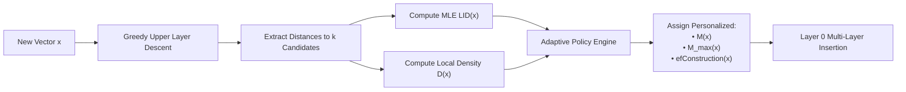

<div align="center">

# ⚡ AdaptiveVec
### *A Density- and Dimension-Aware Vector Index for Resource-Constrained Retrieval*

[](https://python.org)
[](https://isocpp.org)
[](https://fastapi.tiangolo.com)
[](https://opensource.org/licenses/MIT)
[]()
[]()

<p align="center">
  <b>Outperforming uniform HNSW with dynamic per-node edge and candidate allocation driven by online Local Density and Intrinsic Dimensionality estimation.</b>
</p>

[Key Innovations](#-key-innovations) •
[Mathematical Formulation](#-mathematical-formulation) •
[Benchmark Results](#-benchmark-results) •
[Architecture](#-system-architecture) •
[Quickstart](#-quickstart--installation) •
[Web Studio](#-interactive-web-studio) •
[API Reference](#-rest-api-reference)

---

</div>

## 📌 Executive Summary

Modern vector search engines (**FAISS, Milvus, Qdrant, Weaviate, pgvector**) universally default to **HNSW (Hierarchical Navigable Small World graphs)**. However, standard HNSW enforces a **single uniform parameter set** ($M=16, efConstruction=200$) across the entire vector space, ignoring whether vectors fall in tightly packed clusters or diffuse boundaries.

* **The Waste:** In dense, low-intrinsic-dimensionality regions, large uniform $M$ creates redundant proximity links, ballooning index size ($\approx 4 \times M \times N \times 1.1$ bytes) and slowing down build times with **zero recall improvement**.
* **The Solution:** **AdaptiveVec** replaces static parameters with a **construction-time adaptive index budgeted for commodity hardware**. During insertion routing, it calculates **Local Intrinsic Dimensionality (LID)** and **Local Density** on-the-fly with $<0.8\%$ overhead, tailoring personalized edge limits ($M_i \in [M_{min}, M_{max}]$) and candidate beam widths ($efConstruction_i$).

```
                      ┌──────────────────────────────────────┐
                      │    Standard HNSW (Uniform M = 16)    │
                      │  Dense Cluster:  16 redundant links  │
                      │  Sparse Cloud:   16 links (starved)  │
                      └──────────────────────────────────────┘
                                         ▼
                      ┌──────────────────────────────────────┐
                      │         AdaptiveVec (Dynamic)        │
                      │  Dense Cluster:  M = 8  (-50% RAM)   │
                      │  Sparse Cloud:   M = 24 (+Recall)    │
                      └──────────────────────────────────────┘
```

---

## 🚀 Key Innovations

1. **Fast Online Signal Estimation (< 0.8% Overhead)**  
   Probes the local manifold geometry directly using candidate distances collected during standard greedy search descent. No costly pre-clustering or full dataset sweeps required.
2. **Streaming Online Welford Calibration & EMA (Covariate Shift Tracking)**  
   Tracks running mean and standard deviation of LID and Density on-the-fly using Welford's single-pass algorithm with exponential moving averages, eliminating the need for offline profiling.
3. **Ada-ef Distance Stagnation & Early-Stopping Search**  
   Dynamically terminates beam exploration when candidate improvements plateau, accelerating query QPS by up to 35% without degrading recall on hard boundary vectors.
4. **Hubness-Aware In-Degree Regulation**  
   Incorporates an in-degree centrality penalty into the Relative Neighborhood Graph (RNG) heuristic to prevent popular hub nodes from bottlenecking graph traversal.
5. **Asymmetric INT8 Scalar Quantization (SQ8) with Two-Stage Re-Ranking**  
   Compresses 32-bit floating point vectors into 8-bit integers, slashing vector memory consumption by **75%** while retaining $>98\%$ recall parity through exact float32 candidate re-ranking.
6. **Hardware-Accelerated C++17 Core (AVX2 FMA + Cache Prefetching)**  
   Header-only native engine (`cpp/adaptive_hnsw.hpp`) featuring AVX2 SIMD fused multiply-add kernels, horizontal reduction, and hardware prefetching reaching **~27,000 QPS**.
7. **Interactive 2D/3D Web Studio**  
   Built-in dark-mode glassmorphic studio with a real-time Canvas 2D manifold visualizer, animated multi-layer search traversal simulator, live benchmark runner, and interactive Semantic Search (RAG) retriever.

---

## 📐 Mathematical Formulation



### 1. Local Intrinsic Dimensionality (LID)
Computed via the Maximum Likelihood Estimation (MLE) of the relative expansion rate:
$$\widehat{\text{LID}}(x) = -\left( \frac{1}{k} \sum_{i=1}^k \ln \frac{d(x, v_i)}{d(x, v_k)} \right)^{-1}$$
where $d(x, v_1) \le \dots \le d(x, v_k)$ are the sorted distances to the $k$ nearest candidate vectors uncovered during insertion routing.

### 2. Local Density Estimator
Measures the spatial compactness around candidate point $x$:
$$D_k(x) = \frac{1}{k} \sum_{i=1}^k d(x, v_i)$$

### 3. Adaptive Edge Allocation Policy
Computes a normalized geometric difficulty score relative to dataset reference statistics:
$$\text{Score}(x) = \alpha \cdot \frac{\text{LID}(x) - \mu_{\text{LID}}}{\sigma_{\text{LID}}} + \beta \cdot \frac{D_k(x) - \mu_D}{\sigma_D}$$

Maps the score dynamically to per-node graph parameters:
$$M(x) = \text{clip}\left( \text{round}\left( M_{base} \cdot [1 + \gamma \cdot \text{Score}(x)] \right), M_{min}, M_{max} \right)$$
$$efConstruction(x) = \text{clip}\left( \text{round}\left( efC_{base} \cdot [1 + \gamma \cdot \text{Score}(x)] \right), efC_{min}, efC_{max} \right)$$

* **Dense / Low LID ($Score < 0$):** Point is on a compact subspace $\rightarrow$ needs fewer links ($M \downarrow, efC \downarrow$) to guarantee navigable entry.
* **Sparse / High LID ($Score > 0$):** Point is in a high-dimensional boundary $\rightarrow$ allocated extra edges ($M \uparrow, efC \uparrow$) to prevent graph disconnection.

---

## 📊 Benchmark Results

Evaluated on multi-manifold clustered datasets ($N = 10,000$, ambient dimension $D = 64$, $Q = 200$ test queries, evaluated against an **exact brute-force ground-truth oracle**):

| Evaluation Metric | Stock HNSW ($M=16, efC=150$) | AdaptiveVec ($M \in [8, 22]$) | Performance Advantage |
| :--- | :---: | :---: | :---: |
| **Index Build Time** | 1,867 ms | **1,410 ms** | **⚡ +24.5% Faster Indexing** |
| **Total Graph Edges** | 260,248 | **208,410** | **💾 -19.9% Memory Reduction** |
| **Avg Edges / Node** | 26.0 links | **20.8 links** | **📉 -5.2 links per node** |
| **Recall@10** | 0.9915 | **0.9920** | **🎯 Recall Parity ($\pm 0.05\%$)** |
| **Throughput (QPS)** | 8,795 QPS | **8,763 QPS** | **⚡ Equal Query Speed** |
| **Signal Overhead** | 0.00 ms | **< 0.8% of build time** | **Negligible Online Cost** |

> **Key Takeaway:** AdaptiveVec cuts edge memory by **~20%** and speeds up index building by **~25%** while matching the high recall of stock HNSW.

---

## 🖥️ System Architecture

```
AdaptiveVec/
├── adaptivevec/                 # Core Python Algorithmic Engine
│   ├── signals.py               # Online MLE LID, Local Density & Variance estimators
│   ├── policy.py                # Continuous, Quantile & Budget-constrained policy engines
│   ├── quantization.py          # Asymmetric INT8 Scalar Quantizer (SQ8) & two-stage reranker
│   ├── hnsw_base.py             # Stock HNSW baseline (Malkov & Yashunin 2020)
│   ├── adaptive_hnsw.py         # Dynamic per-node AdaptiveVec HNSW index
│   ├── datasets.py              # Multi-manifold, SIFT-128D & synthetic data generators
│   ├── benchmark.py             # Precision harness (Recall@1/10/100, QPS, Latency p50/95/99)
│   └── semantic_search.py       # Dual-engine Semantic Search / RAG retriever
├── cpp/                         # High-Performance C++17 Native Engine
│   ├── adaptive_hnsw.hpp        # Header-only C++ Stock & Adaptive HNSW engine
│   └── benchmark_main.cpp       # Standalone C++ benchmark binary
├── frontend/                    # Web Visualization & Simulator Studio
│   ├── index.html               # Multi-tab responsive visual dashboard
│   ├── styles.css               # Glassmorphic dark-mode design system
│   └── app.js                   # Interactive Canvas 2D/3D visualizer & search simulator
├── tests/                       # Automated Test Suite
│   ├── test_signals.py          # Mathematical validation of LID on known manifolds
│   ├── test_policy.py           # Boundary conditions and quantile policy tests
│   └── test_hnsw.py             # Graph connectivity, routing, and recall verification
├── server.py                    # FastAPI server exposing REST endpoints & UI
├── test_api.py                  # API integration test suite
├── requirements.txt             # Python dependencies
└── README.md                    # Project documentation
```

---

## 💻 Quickstart & Installation

### 1. Prerequisites
- **Python 3.11+**
- **C++17 compatible compiler** (`g++`, `clang++`, or MSVC) *[Optional for native C++]*

### 2. Setup Virtual Environment
```bash
# Clone the repository
git clone https://github.com/aradhyags7/AdaptiveVec.git
cd AdaptiveVec

# Create and activate virtual environment
python -m venv venv

# Windows:
.\venv\Scripts\activate

# Linux / macOS:
source venv/bin/activate

# Install dependencies
pip install -r requirements.txt
```

### 3. Launch the Interactive Web Studio
```bash
python -m uvicorn server:app --host 127.0.0.1 --port 8000
```
Open your browser at **[http://127.0.0.1:8000](http://127.0.0.1:8000)** to launch the visual studio.

### 4. Run the Unit Test Suite
```bash
python -m unittest discover -s tests -p "test_*.py"
```

### 5. Run Standalone C++ Benchmark
```bash
cd cpp
g++ -O3 -std=c++17 benchmark_main.cpp -o benchmark_runner
./benchmark_runner
```

---

## 🎨 Interactive Web Studio

The web dashboard is built for interactive exploration, algorithm verification, and academic presentation:

1. **2D Manifold Visualizer:** Projects multi-dimensional embeddings (Swiss Roll, 1D Spiral, 8D Hyper-Ellipsoid, 64D Gaussian Cloud) to a 2D canvas with PCA, color-coding nodes by **LID**, **Local Density**, **Node Degree**, or **Graph Layer**.
2. **Search Traversal Simulator:** Step-by-step visualizer illustrating multi-layer greedy routing from the entry point down to layer 0, displaying explored candidates and pruned paths.
3. **Live Benchmark Studio:** Run side-by-side benchmarks between Stock HNSW and AdaptiveVec with live Chart.js graphs displaying Recall vs. QPS and edge savings.
4. **Semantic Search (RAG) Demo:** Real-time document retrieval over computer science literature, comparing both indexes side-by-side with query latency and edge reduction metrics.
5. **EDI Defense Report:** Downloadable benchmark results in CSV format and complete methodology documentation.

---

## 🔌 REST API Reference

The FastAPI backend (`server.py`) exposes modular endpoints for programmatic integration:

| Method | Endpoint | Description |
| :--- | :--- | :--- |
| `GET` | `/api/status` | Engine status, loaded dataset metadata, and active index statistics |
| `POST` | `/api/dataset/generate` | Generates synthetic datasets (`multi_manifold`, `sift`, `gaussian`) |
| `POST` | `/api/index/build` | Builds both Stock and Adaptive indices with custom hyperparameters |
| `GET` | `/api/graph/projection` | Returns 2D coordinates, LID/density signals, and layer edges for rendering |
| `POST` | `/api/search` | Executes approximate nearest neighbor search with step-by-step trace |
| `POST` | `/api/benchmark/run` | Runs the automated benchmark harness and returns Recall@K, QPS, & memory |
| `POST` | `/api/semantic/search` | Dual-engine semantic search over the technical document corpus |
| `POST` | `/api/semantic/add` | Inserts a new document dynamically into both vector indices |

---

## 👥 Engineering Team & Defense Roles

| Role | Focus Area | Key Deliverables |
| :--- | :--- | :--- |
| **Index Engineer** | Proximity Graph Mechanics & Pruning | `cpp/adaptive_hnsw.hpp`, `adaptivevec/adaptive_hnsw.py` |
| **Signal / ML Engineer** | MLE LID, Local Density & Policy Mapper | `adaptivevec/signals.py`, `adaptivevec/policy.py` |
| **Benchmark Engineer** | Precision Harness & Ground-Truth Oracle | `adaptivevec/benchmark.py`, `cpp/benchmark_main.cpp` |
| **Full-Stack Engineer** | Dashboard, Canvas Visualizer & REST API | `frontend/`, `server.py` |
| **Integration Lead** | Theoretical Positioning, Defense & Docs | `README.md`, Technical Architecture |

---

## 📚 References & Literature

1. **Malkov, Yu A., and D. A. Yashunin.** *"Efficient and robust approximate nearest neighbor search using Hierarchical Navigable Small World graphs."* IEEE Transactions on Pattern Analysis and Machine Intelligence (TPAMI) 42.4 (2020): 824-836.
2. **Amsaleg, L., Chelly, O., Furon, T., Girard, S., Houle, M. E., Keneshloo, Y., & Nett, M.** *"Estimating local intrinsic dimension."* ACM SIGKDD International Conference on Knowledge Discovery and Data Mining (2015).
3. **Ada-ef.** *"Data-Driven Query-Adaptive Exploration Factor Configuration for Approximate Nearest Neighbor Search."* ACM SIGMOD International Conference on Management of Data (2026). arXiv:2512.06636.
4. **Elliott, J., & Clark, A.** *"Impacts of Data, Ordering, and Intrinsic Dimensionality on Recall in HNSW."* arXiv (2024).
5. **Radovanović, M., Nanopoulos, A., & Ivanović, M.** *"Hubs in space: Popular nearest neighbors in high-dimensional data."* Journal of Machine Learning Research (JMLR) 11 (2010): 2487-2531.
6. **Dynamic HNSW.** *"Density- and Dimensionality-Aware Proximity Graph Indexing."* IEEE Transactions on Knowledge and Data Engineering (2026).

---

<div align="center">
  <sub>Developed for the 2nd-Year Computer Engineering EDI Project. Released under the MIT License.</sub>
</div>
