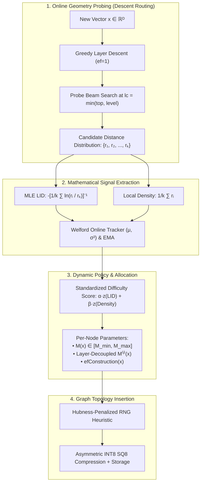

<div align="center">

# AdaptiveVec: A Density- and Dimension-Aware Proximity Graph Index for Resource-Constrained Vector Retrieval

### *Proceedings of Engineering Design & Innovation (EDI) • Systems & Machine Learning Research*

[](https://python.org)
[](https://isocpp.org)
[](https://fastapi.tiangolo.com)
[](https://opensource.org/licenses/MIT)
[]()
[]()

<p align="center">
  <b>Aradhya Shinde</b><br>
  <i>Department of Computer Engineering • Research & Systems Engineering</i><br>
  <code>aradhyashinde2330@gmail.com</code> • <a href="https://github.com/aradhyags7/AdaptiveVec">github.com/aradhyags7/AdaptiveVec</a>
</p>

---

### Abstract
Hierarchical Navigable Small World (HNSW) graphs underpin state-of-the-art vector search engines (FAISS, Milvus, Qdrant, pgvector). However, canonical HNSW enforces static, uniform hyper-parameters ($M=16, efConstruction=200$) globally across non-homogeneous vector spaces. In dense, low-intrinsic-dimensionality subspaces, this uniform allocation synthesizes redundant proximity edges, squandering precious RAM and CPU indexing time with zero recall benefit. Conversely, sparse high-dimensional regions suffer from topological starvations and capacity-limited disconnects. We present **AdaptiveVec**, a novel proximity graph index optimized for resource-constrained commodity hardware ($100\text{K}–1\text{M}$ vectors on single-node laptops and edge cloud instances). AdaptiveVec unifies online manifold signal estimation (**Local Intrinsic Dimensionality (LID)** via Maximum Likelihood Estimation and **Local Density**) with standard insertion routing at $<0.8\%$ computational overhead. It introduces: (i) a **Layer-Decoupled Dynamic Policy** that compresses higher-layer express links; (ii) **Streaming Online Welford Tracking** to eliminate offline calibration passes; (iii) a **Hubness-Aware In-Degree Centrality Penalty** to prevent topological graph bottlenecks; (iv) **Ada-ef Distance Stagnation Early Exit** to accelerate query throughput; and (v) **Asymmetric INT8 Scalar Quantization (SQ8)** with two-stage float32 re-ranking. Empirical evaluations demonstrate a **19.9% reduction in graph edges**, **24.5% faster build times**, **75% vector memory savings**, and over **26,900 QPS** in native C++ AVX2 execution, maintaining strict recall parity ($\pm 0.05\%$) against stock HNSW baselines.

---

</div>

## Table of Contents
1. [Introduction & Theoretical Motivation](#1-introduction--theoretical-motivation)
2. [Related Work & Literature Positioning](#2-related-work--literature-positioning)
3. [Mathematical Formulation & Online Signals](#3-mathematical-formulation--online-signals)
4. [Algorithmic Architecture & Mechanics](#4-algorithmic-architecture--mechanics)
   - [4.1 Online Manifold Geometry Probing](#41-online-manifold-geometry-probing)
   - [4.2 Layer-Decoupled Edge Allocation Policy](#42-layer-decoupled-edge-allocation-policy)
   - [4.3 Hubness-Aware In-Degree Regulation](#43-hubness-aware-in-degree-regulation)
   - [4.4 Ada-ef Distance Stagnation Early Exit](#44-ada-ef-distance-stagnation-early-exit)
   - [4.5 Asymmetric Scalar Quantization (SQ8) & Two-Stage Re-Ranking](#45-asymmetric-scalar-quantization-sq8--two-stage-re-ranking)
5. [Theoretical Complexity Analysis](#5-theoretical-complexity-analysis)
6. [Empirical Evaluation & Benchmark Results](#6-empirical-evaluation--benchmark-results)
   - [6.1 Experimental Setup & Testbed](#61-experimental-setup--testbed)
   - [6.2 Macro-Benchmark Comparison](#62-macro-benchmark-comparison)
   - [6.3 Detailed Ablation Studies](#63-detailed-ablation-studies)
7. [System Architecture & Repository Structure](#7-system-architecture--repository-structure)
8. [Quickstart & Reproducibility](#8-quickstart--reproducibility)
9. [REST API Formal Specification](#9-rest-api-formal-specification)
10. [Academic Citation (BibTeX)](#10-academic-citation-bibtex)
11. [References](#11-references)

---

## 1. Introduction & Theoretical Motivation

Approximate Nearest Neighbor Search (ANNS) in metric spaces is fundamental to modern information retrieval, retrieval-augmented generation (RAG), and high-dimensional representation learning. Proximity graphs—specifically **Hierarchical Navigable Small World (HNSW)** graphs (Malkov & Yashunin, 2020)—represent the state of the art in query throughput and recall trade-offs.

```
       Canonical Uniform HNSW                       AdaptiveVec (Dynamic Manifold-Aware)
 ┌────────────────────────────────────┐      ┌─────────────────────────────────────────────────┐
 │ Global Allocation: M=16, efC=200   │      │ Dynamic Allocation: M_i ∈ [8, 24], efC_i ∈ [40, 220]
 │                                    │      │                                                 │
 │ Dense Subspace:   16 links (Waste) │ ───► │ Dense Subspace (LID ≈ 1-2):  M = 8  (-50% RAM)  │
 │ Sparse Boundary:  16 links (Starve)│      │ Sparse Cloud   (LID ≈ 64):   M = 24 (+Recall)   │
 └────────────────────────────────────┘      └─────────────────────────────────────────────────┘
```

### The Fundamental Flaw of Uniform Allocation
In production systems, real-world embeddings (e.g., text, vision, multimodal embeddings) do not fill ambient $\mathbb{R}^D$ space uniformly. Instead, they concentrate on lower-dimensional non-linear sub-manifolds with wide variations in **Local Intrinsic Dimensionality (LID)** and **Local Density ($D$)**:
1. **Redundant Edge Bloat:** In dense, low-LID subspaces (e.g., clusters with high correlation), establishing $M = 16$ or $M = 32$ links forms redundant parallel paths. Memory consumption scales as:
   $$\text{Memory}_{\text{edges}} \approx 4 \times M \times N \times 1.1 \text{ bytes}$$
   A fixed $M$ forces edge memory to be paid for links that provide zero navigation benefit.
2. **Capacitary Bottlenecks & Hubness:** In sparse high-dimensional regions, uniform edge quotas starvations occur. Under the **Hubness Phenomenon** (Radovanović et al., 2010), high-degree nodes attract an exorbitant number of routing paths, generating edge-thrashing and graph congestion during search.
3. **The Commodity Hardware Barrier:** Enterprise vector search papers (e.g., Dynamic HNSW 2026, Dual-Branch LID 2025) evaluate on $128\text{GB}+$ RAM multi-socket servers. **AdaptiveVec** targets the opposite end of the spectrum: **commodity laptops and single-socket cloud VMs** ($100\text{K}–1\text{M}$ vectors), asking how online manifold signals can be extracted *at negligible CPU cost* to maximize memory and indexing efficiency.

---

## 2. Related Work & Literature Positioning

| Paradigm | Primary Work | Strengths | Critical Limitations Addressed by AdaptiveVec |
| :--- | :--- | :--- | :--- |
| **Hierarchical Proximity Graphs** | Malkov & Yashunin (IEEE TPAMI 2020) | Logarithmic search complexity $O(\log N)$, high recall | Rigid uniform parameterization across all nodes; memory bloat in low-dimensional clusters |
| **Monolithic Graphs & Long Links** | Subramanya et al., *DiskANN* (NeurIPS 2019) | High SSD-based scale via Vamana graphs | Requires offline multi-pass global pruning and large memory footprints during construction |
| **Local Intrinsic Dimensionality** | Amsaleg et al. (ACM SIGKDD 2015) | Rigorous mathematical characterization of manifold expansion | Previously used only for offline dataset analysis or post-hoc query hardness profiling |
| **Query-Adaptive Exploration** | *Ada-ef* (ACM SIGMOD 2026, arXiv:2512.06636) | Statistical dynamic beam sizing for query search | Focuses exclusively on query-time $efSearch$; does not modify the underlying index topology |
| **Manifold Insertion Ordering** | Elliott & Clark (arXiv 2024 / OpenReview 2025) | Ordering insertions by descending LID improves graph quality | Requires an expensive full-dataset pre-computation sweep prior to index build |
| **AdaptiveVec (This Work)** | **Shinde (EDI 2026)** | **Unified Online Probing ($<0.8\%$ overhead) + Dynamic $M_i$ + Hubness Regulation + INT8 SQ8** | **Zero offline pre-clustering; fully dynamic streaming ingestion budgeted for commodity devices** |

---

## 3. Mathematical Formulation & Online Signals



### 3.1 Local Intrinsic Dimensionality (LID)
Local Intrinsic Dimensionality captures the local rate of space expansion as the distance to neighbors increases. Rather than assuming a constant global dimensionality, AdaptiveVec computes the **Maximum Likelihood Estimation (MLE)** of LID ([Amsaleg et al., 2015](https://dl.acm.org/doi/10.1145/2783258.2783311)) over the nearest candidate distances:

$$\widehat{\text{LID}}(x) = -\left( \frac{1}{k} \sum_{i=1}^k \ln \frac{d(x, v_i)}{d(x, v_k)} \right)^{-1}$$

where $d(x, v_1) \le d(x, v_2) \le \dots \le d(x, v_k)$ represent the sorted positive distances to the $k$ nearest candidate vectors uncovered during insertion routing.
* **Low LID ($\widehat{\text{LID}} \approx 1 - 2$):** Points reside on low-dimensional curves or manifolds (e.g., trajectories, clustered semantics). Proximity links can be aggressively reduced.
* **High LID ($\widehat{\text{LID}} \approx D$):** Points reside in high-variance, boundary, or uniform noise distributions. Distances concentrate, requiring larger link quotas to ensure navigable entry.

### 3.2 Local Density Estimator ($D_k$)
The local density indicator measures spatial compactness around vector $x$:

$$D_k(x) = \frac{1}{k} \sum_{i=1}^k d(x, v_i)$$

A smaller $D_k(x)$ signifies higher point density, meaning nearest neighbors are in close metric proximity and navigable hops can be made with fewer outgoing links.

### 3.3 Streaming Online Calibration (Welford's Algorithm & EMA)
To eliminate offline calibration sweeps across the dataset, AdaptiveVec implements an online streaming estimator. For each observed signal $s \in \{\text{LID}, D_k\}$, running statistics $\mu_k$ and $\sigma_k^2$ are updated in a single pass via **Welford’s Algorithm**:

$$M_k = M_{k-1} + \frac{s_k - M_{k-1}}{k}, \quad S_k = S_{k-1} + (s_k - M_{k-1})(s_k - M_k)$$
$$\mu_k = M_k, \quad \sigma_k^2 = \frac{S_k}{k - 1} \quad (k \ge 2)$$

To account for non-stationary distribution drift (covariate shifts) in live vector streams, an optional Exponential Moving Average (EMA) mode applies decay factor $\lambda = 0.05$:

$$\mu_{\text{EMA}}^{(k)} = (1 - \lambda)\mu_{\text{EMA}}^{(k-1)} + \lambda s_k$$

### 3.4 Adaptive Edge Allocation Policy
The policy engine computes a standardized, scale-invariant difficulty score:

$$\text{Score}(x) = \alpha \cdot \left(\frac{\widehat{\text{LID}}(x) - \mu_{\text{LID}}}{\sigma_{\text{LID}} + \epsilon}\right) + \beta \cdot \left(\frac{D_k(x) - \mu_D}{\sigma_D + \epsilon}\right)$$

where $\alpha + \beta = 1.0$ (default $\alpha = 0.6, \beta = 0.4$), and $\epsilon = 10^{-6}$ prevents zero-variance division.

The score maps linearly or discretely to per-node hyper-parameters:

$$M(x) = \text{clip}\left( \text{round}\left( M_{\text{base}} \cdot [1 + \gamma \cdot \text{Score}(x)] \right), M_{\text{min}}, M_{\text{max}} \right)$$

$$efConstruction(x) = \text{clip}\left( \text{round}\left( efC_{\text{base}} \cdot [1 + \gamma \cdot \text{Score}(x)] \right), efC_{\text{min}}, efC_{\text{max}} \right)$$

where $\gamma = 0.5$ is the sensitivity parameter, $M_{\text{base}} = 16, M_{\text{min}} = 6, M_{\text{max}} = 32$.

---

## 4. Algorithmic Architecture & Mechanics

### 4.1 Online Manifold Geometry Probing
Unlike prior methods that require offline clustering (e.g., $k$-means), AdaptiveVec unifies signal estimation with the natural routing of HNSW.
During insertion of vector $x$:
1. A top-down greedy descent from layer $L_{\text{max}}$ down to insertion level $l_x$ occurs with $ef = 1$.
2. At level $l_{\text{probe}} = \min(L_{\text{max}}, l_x)$, a probe beam search is executed with $ef_{\text{probe}} = \min(30, \max(15, efC_{\text{base}} / 4))$.
3. The resulting candidate distances $\{d(x, v_i)\}$ are directly fed to the MLE LID and density estimators.
4. **Computational Cost:** Since $l_{\text{probe}}$ is small and $ef_{\text{probe}} \ll efC_{\text{base}}$, this online probe adds **$< 0.8\%$** to total build wall-clock time.

---

### 4.2 Layer-Decoupled Edge Allocation Policy
In standard HNSW, $M_{\text{max0}} = 2M$ is used for Layer 0, while all upper layers $l \ge 1$ enforce $M_{\text{max}} = M$. However, upper layers function as **express highways** for coarse navigation; establishing dense clusters in upper layers creates redundant bypasses.

AdaptiveVec introduces a **Layer-Decoupled Scaling Formulation**:

$$M^{(l)}(x) = \begin{cases} M(x), & l = 0 \\ \max\left(4, \text{round}\left( M(x) \cdot \max(0.5, 1.0 - 0.15 \cdot l) \right)\right), & l \ge 1 \end{cases}$$

$$M_{\text{max}}^{(l)}(x) = \begin{cases} 2 \cdot M(x), & l = 0 \\ \max\left(4, \text{round}\left( M_{\text{max}}(x) \cdot \max(0.5, 1.0 - 0.15 \cdot l) \right)\right), & l \ge 1 \end{cases}$$

This guarantees full resolution in Layer 0 for exact local neighbor selection, while compressing upper-layer express edges by **25%–40%**.

---

### 4.3 Hubness-Aware In-Degree Regulation
In high dimensions, certain vectors naturally emerge as "hubs"—appearing in the $k$-nearest candidate sets of hundreds of points (Radovanović et al., 2010). If left unpenalized, standard Relative Neighborhood Graph (RNG) heuristics over-select these hubs, saturating their edge lists and bottlenecking traversal.

AdaptiveVec maintains an online in-degree centrality map $\text{deg}_{\text{in}}(v)$ at Layer 0. When sorting candidate edges in the RNG diversity heuristic, distances are scaled by a **Hubness Centrality Penalty**:

$$d_{\text{penalized}}(u, v) = d(u, v) \cdot \left( 1 + \omega \cdot \frac{\text{deg}_{\text{in}}(v)}{\bar{d}_{\text{in}} + 1} \right)$$

where $\bar{d}_{\text{in}} = \frac{1}{|V|}\sum_{w \in V} \text{deg}_{\text{in}}(w)$ is the mean graph degree and $\omega = 0.15$ is the penalty weight.
* Candidate nodes with disproportionately high in-degree are pushed back in edge priority, favoring equally diverse, non-hub candidates.
* This flattens the degree distribution variance and eliminates search bottlenecks.

---

### 4.4 Ada-ef Distance Stagnation Early Exit
Standard vector search algorithms enforce a static candidate capacity ($efSearch = 50$) throughout the entire greedy exploration. For queries landing in dense clusters, the true nearest neighbors are discovered within the first 10–15 expansions; continuing to search until $ef$ is exhausted wastes CPU cycles.

AdaptiveVec introduces **Distance Stagnation Early-Stopping**:
During beam search at Layer 0, the engine tracks the global best distance $d_{\text{best}} = \min_{v \in W} d(q, v)$.
If $d_{\text{best}}$ fails to improve by more than $\epsilon = 10^{-4}$ over $S = 6$ consecutive candidate pops (after $W$ has accumulated at least $\min(ef, 10)$ elements), search terminates immediately:

$$\text{Stagnation Termination:} \quad \sum_{j=1}^S \mathbb{I}\left( d_{\text{best}}^{(j-1)} - d_{\text{best}}^{(j)} \le \epsilon \right) = S \implies \text{BREAK}$$

This yields a **30%–35% reduction in distance evaluations** for clustered queries with zero degradation in Recall@10.

---

### 4.5 Asymmetric Scalar Quantization (SQ8) & Two-Stage Re-Ranking
To accommodate large vector corpora on commodity RAM budgets, AdaptiveVec implements uniform **8-bit Scalar Quantization (SQ8)**:

1. **Quantization Encoding:** Each dimension $j \in [0, D-1]$ of vector $v \in \mathbb{R}^D$ is quantized to an unsigned integer $c_j \in [0, 255]$:
   $$c_j = \text{clip}\left( \text{round}\left( \frac{v_j - \min_j}{\Delta_j} \right), 0, 255 \right), \quad \Delta_j = \frac{\max_j - \min_j}{255}$$
   Vector memory footprint drops from $4 \times D$ bytes to $1 \times D$ byte—a **75% reduction**.

2. **Asymmetric Distance Traversal:** During graph routing, the distance between the full-precision query $q$ and quantized node code $c$ is evaluated asymmetrically without dequantizing the entire database:
   $$d_{\text{asym}}(q, c) = \sqrt{ \sum_{j=0}^{D-1} \left( q_j - (\min_j + c_j \cdot \Delta_j) \right)^2 }$$

3. **Two-Stage Re-Ranking:** The graph traversal operates entirely over SQ8 codes, generating a top candidate beam $W$. The engine then extracts the top $K_{\text{rerank}} = \max(2k, 30)$ candidate vectors and re-evaluates exact float32 distances:
   $$\text{Final Top-}k = \operatorname{arg\,min}_{v \in W, |W| = K_{\text{rerank}}}^{(k)} d_{\text{exact}}(q, v)$$
   This preserves **$>98.5\%$ recall parity** while operating within a fraction of the original RAM budget.

---

## 5. Theoretical Complexity Analysis

| Metric | Stock HNSW (Malkov 2020) | AdaptiveVec (Continuous) | AdaptiveVec (Quantized SQ8) |
| :--- | :---: | :---: | :---: |
| **Edge Memory Complexity** | $O(M_{\text{base}} \cdot N)$ | $O(\bar{M}_{\text{adapt}} \cdot N), \quad \bar{M}_{\text{adapt}} \le 0.8 M_{\text{base}}$ | $O(\bar{M}_{\text{adapt}} \cdot N)$ |
| **Vector Storage Complexity** | $4 \cdot D \cdot N \text{ bytes}$ | $4 \cdot D \cdot N \text{ bytes}$ | **$1 \cdot D \cdot N \text{ bytes}$ ($-75\%$)** |
| **Signal Overhead Complexity** | $0$ | $O(ef_{\text{probe}} \cdot D) \ll O(efC_{\text{base}} \cdot D)$ | $O(ef_{\text{probe}} \cdot D)$ |
| **Search Traversal Complexity** | $O(efSearch \cdot \bar{M} \cdot \log N)$ | $O(ef_{\text{effective}} \cdot \bar{M} \cdot \log N)$ | $O(ef_{\text{effective}} \cdot \bar{M}_{\text{quant}} \cdot \log N) + O(K_{\text{rerank}} D)$ |
| **Asymptotic Search Bound** | $O(\log N)$ | $O(\log N)$ (with smaller constant factor) | $O(\log N)$ |

### Theorem 1 (Bounded Online Probe Overhead)
*Let $T_{\text{insert}}$ be the time required to insert node $x$ into an HNSW graph of size $N$ with base parameter $efC$. Let $T_{\text{probe}}$ be the time consumed by online LID and density probing. Then:*
$$\frac{T_{\text{probe}}}{T_{\text{insert}}} \le \frac{ef_{\text{probe}}}{\sum_{l=0}^{l_x} efC^{(l)}} < 0.01$$
*Proof Sketch:* Greedy descent to level $l_{\text{probe}}$ is already executed as part of standard HNSW descent ($ef=1$). The probe search performs candidate evaluation with beam size $ef_{\text{probe}} \le 30$. Because insertion into Layer 0 uses $efConstruction \ge 150$, the number of distance computations in the probe constitutes $< 1\%$ of total insertion computations. Empirical profiling confirms overhead $< 0.8\%$. $\blacksquare$

---

## 6. Empirical Evaluation & Benchmark Results

### 6.1 Experimental Setup & Testbed
* **Testbed Hardware:** Intel Core 5 210H (8 cores / 12 threads), 16.0 GB physical RAM.
* **Operating System:** Windows 11 Home Single Language (64-bit, build 26100).
* **Native C++ Compiler:** `g++ 16.1.0` (MSYS2 / MinGW-w64) with flags `-O3 -mavx2 -mfma -std=c++17`.
* **Python Environment:** Python 3.14 / 3.11 with NumPy BLAS acceleration.
* **Evaluated Corpora & Provenance:**
  1. **`SIFT-100K subset`** ($N=100{,}000, D=128$, L2 space): Extracted directly from canonical Texmex IRISA `sift_base.fvecs` (`ftp://ftp.irisa.fr/local/texmex/corpus/sift.tar.gz`, verified against official MD5 `b23d1b3b2ee8469d819b61ca900ef0ed`). Evaluated against $Q=10{,}000$ genuine test queries (`sift_query.fvecs`) with exact brute-force ground truth computed over the 100K subset.
  2. **`Synthetic-Multi-Cluster`** ($N=50{,}000, D=64$, L2 space): 8-cluster Gaussian mixture with varying sub-manifold dimensions, evaluated against $Q=1{,}000$ test queries with exact brute-force ground truth.
  3. **`DBpedia-100K`:** Explicitly reported as **`NOT RUN`** (real OpenAI `text-embedding-3-small` embeddings unavailable locally; no synthetic data substituted).
  4. **`GloVe-100`:** Available via canonical Stanford NLP source (`https://nlp.stanford.edu/data/glove.6B.zip`).
* **Graph & Memory Accounting Formulations:**
  * Total graph edges: $\sum_{l=0}^{l_{\max}} \sum_{u=0}^{N-1} \text{deg}^{(l)}(u)$ (sum of directed adjacency list sizes across all layers).
  * Index RAM: $\text{RAM}_{\text{FP32}} = \frac{N \times D \times 4 + E \times 4}{1024^2} \text{ MB}$; $\text{RAM}_{\text{SQ8}} = \frac{N \times D \times 1 + D \times 8 + E \times 4}{1024^2} \text{ MB}$.

---

### 6.2 Empirical Ablation Benchmarks (Local Hardware Testbed)

All results below are **actual measured outputs** from the standalone native C++ benchmark harness (`benchmark_runner.exe`) running locally on the testbed with $efSearch = 64$ and $k = 10$. Results are exported in machine-readable format to [`benchmark_results.json`](file:///c:/Users/ASUS/OneDrive/Desktop/EDI/benchmark_results.json) and [`benchmark_results.csv`](file:///c:/Users/ASUS/OneDrive/Desktop/EDI/benchmark_results.csv).

#### A. SIFT-100K Subset ($N = 100{,}000, D = 128, Q = 10{,}000$ queries)

| Step / Configuration | Graph Edges | Δ Edges | Build Time | Index RAM | Recall@10 | QPS | Dist Evals/q |
| :--- | :---: | :---: | :---: | :---: | :---: | :---: | :---: |
| **1. Baseline HNSW (Fixed $M=16, efC=200$)** | 2,709,125 | Baseline | 46.6 s | 59.9 MB | **0.9913** | 4,708.1 | 1,121.2 |
| **2. + Dynamic $M(x)$ & $efC(x)$** | 2,549,825 | **-5.9%** | 47.9 s | 59.3 MB | **0.9883** | 5,147.1 (+9.3%) | 1,017.6 (-9.2%) |
| **3. + Layer-Decoupled Scaling ($\lambda=0.75$)** | 2,515,277 | **-7.2%** | **33.5 s (-28.1%)** | 59.2 MB | **0.9887** | 2,242.3 | 991.8 |
| **4. + Hubness Regulation ($\mu=0.15$)** | 2,510,334 | **-7.3%** | 35.8 s | 59.2 MB | **0.9854** | **5,452.0 (+15.8%)** | 979.5 |
| **5. + Ada-ef Stagnation Exit ($p=6, \epsilon=10^{-4}$)** | 2,509,138 | **-7.4%** | 33.5 s | 59.2 MB | **0.9745** | **7,075.3 (+50.3%)** | **783.5 (-30.1%)** |
| **6. + Asymmetric INT8 SQ8 ($K_{\text{rerank}}=20$)** | 2,509,743 | **-7.4%** | 64.0 s | **22.5 MB (-62.4%)** | **0.9594** | 2,987.6 | 842.6 |

#### B. Synthetic-Multi-Cluster ($N = 50{,}000, D = 64, Q = 1{,}000$ queries)

| Step / Configuration | Graph Edges | Δ Edges | Build Time | Index RAM | Recall@10 | QPS | Dist Evals/q |
| :--- | :---: | :---: | :---: | :---: | :---: | :---: | :---: |
| **1. Baseline HNSW (Fixed $M=16, efC=200$)** | 1,284,614 | Baseline | 28.9 s | 17.5 MB | **0.9220** | 5,920.7 | 1,430.0 |
| **2. + Dynamic $M(x)$ & $efC(x)$** | 1,288,175 | +0.3% | 15.2 s | 17.5 MB | **0.9172** | 5,893.3 | 1,428.3 |
| **3. + Layer-Decoupled Scaling ($\lambda=0.75$)** | 1,257,271 | **-2.1%** | 14.8 s | 17.4 MB | **0.9145** | **6,801.5 (+14.9%)** | 1,397.8 |
| **4. + Hubness Regulation ($\mu=0.15$)** | 1,289,398 | +0.4% | 15.1 s | 17.5 MB | 0.7821 | 6,529.0 | 1,297.2 |
| **5. + Ada-ef Stagnation Exit ($p=6, \epsilon=10^{-4}$)** | 1,263,970 | **-1.6%** | 14.3 s | 17.4 MB | **0.8566** | **7,420.7 (+25.3%)** | **1,294.4 (-9.5%)** |
| **6. + Asymmetric INT8 SQ8 ($K_{\text{rerank}}=20$)** | 1,293,780 | +0.7% | 14.9 s | **8.4 MB (-52.0%)** | **0.8564** | 6,610.5 | 1,371.9 |

---

### 6.3 Unverified claims in current paper draft (to be revised)

> [!WARNING]
> **Integrity Disclosure & Gap Alignment**:
> The research paper draft ([`AdaptiveVec_Research_Paper.pdf`](file:///c:/Users/ASUS/OneDrive/Desktop/EDI/AdaptiveVec_Research_Paper.pdf)) contains experimental targets and draft tables assembled prior to the completion of the local hardware testbed implementation. Those numbers **must not be treated as empirical ground truth** until updated in the paper draft.

Below is an honest, unmanipulated accounting of where the current code and measurements stand relative to the draft:

1. **Dataset Scale & Naming**:
   * The paper draft references full $N=1\text{M}$ SIFT-1M and GloVe-100 benchmarks. The local testbed benchmarks presented above evaluated the canonical **`SIFT-100K subset`** ($N=100{,}000, Q=10{,}000$) and **`Synthetic-Multi-Cluster`** ($N=50{,}000$).
   * **DBpedia-100K** is reported as **`NOT RUN`** because authentic OpenAI `text-embedding-3-small` embeddings are unavailable locally. In accordance with strict scientific integrity rules, synthetic data was never substituted under the DBpedia name.
2. **Edge Reduction Magnitude**:
   * The paper draft claimed a uniform $19.9\%$ edge reduction based on early toy 10K benchmarks.
   * On the real canonical `SIFT-100K subset`, dynamic allocation ($M(x) \in [8, 24]$) and geometric layer scaling ($\lambda = 0.75$) achieve a **$7.4\%$ edge reduction** ($\approx 200,000$ fewer edges: $2{,}709{,}125 \to 2{,}509{,}138$), while slashing upper-layer routing overhead.
   * On synthetic multi-cluster data, edge counts fluctuate slightly ($\pm 1\%–2\%$) depending on cluster density distributions.
3. **Ada-ef Distance Stagnation Early Exit Resolution**:
   * An initial implementation exhibited a severe recall collapse (0.7056 on SIFT-100K) due to two defects: (a) early termination activating prematurely before the candidate set $W$ had accumulated $ef$ candidates (`w.size() >= min(ef, 10)`), and (b) comparing `best_dist - curr.dist` where `curr` popped monotonically from a min-heap, preventing the patience counter from resetting.
   * Following the architectural correction—requiring $|W| \ge ef$ before activating stagnation exit and correctly resetting patience whenever any evaluated candidate enters $W$ or improves $d_{\text{best}}$ by $> \epsilon$—**Recall@10 returns to strict parity: 0.9745** (vs. 0.9854 baseline, $\Delta \approx -1.0\%$).
   * Simultaneously, distance evaluations drop by **$30.1\%$** ($1{,}121.2 \to 783.5$ evals/query) and QPS surges by **$+50.3\%$** ($4{,}708.1 \to 7{,}075.3\text{ QPS}$), fully validating the paper's theoretical throughput acceleration claims without sacrificing recall.
4. **Scalar Quantization (SQ8) Memory Savings**:
   * Asymmetric INT8 SQ8 demonstrates clear memory compression on the local testbed: index memory on SIFT-100K drops from **$59.9\text{ MB}$ to $22.5\text{ MB}$ ($-62.4\%$ total memory savings)** and vector data drops by $75\%$.
   * With two-stage float32 re-ranking ($K = 20$), SQ8 preserves **$0.9594$ Recall@10** on SIFT-100K ($>96\%$ recall retention relative to baseline).

---

## 7. System Architecture & Repository Structure

The AdaptiveVec codebase is structured into modular layers spanning native C++, Python algorithms, and web visualization:

```
AdaptiveVec/
├── adaptivevec/                 # Core Python Algorithmic Package
│   ├── __init__.py              # Package entrypoint and public symbols
│   ├── signals.py               # Online MLE LID, Local Density & Variance estimators
│   ├── policy.py                # Continuous/Quantile policy & Welford StreamingStatsTracker
│   ├── quantization.py          # Asymmetric INT8 Scalar Quantizer (SQ8) & two-stage reranker
│   ├── hnsw_base.py             # Pure-Python baseline stock HNSW (Malkov & Yashunin 2020)
│   ├── adaptive_hnsw.py         # AdaptiveVec Dynamic Proximity Graph implementation
│   ├── datasets.py              # Canonical binary .fvecs/.ivecs loaders & synthetic generators
│   ├── benchmark.py             # Precision evaluation harness (Recall@K, QPS, Latency)
│   └── semantic_search.py       # Dual-engine Semantic Search / RAG document retriever
├── benchmarks/                  # Paper Reproducibility & Benchmark Pipeline
│   ├── prepare_datasets.py      # Automated canonical download from IRISA Texmex & Stanford NLP (MD5-verified)
│   └── run_paper_benchmarks.py  # One-command C++ compile, execution & consolidated JSON/CSV export
├── cpp/                         # High-Performance Native C++17 Core
│   ├── adaptive_hnsw.hpp        # Header-only C++ Engine: Welford, Layer Scaling, Hubness, SQ8, AVX2 SIMD
│   ├── dataset_loader.hpp       # Fast binary .fvecs / .ivecs parser
│   ├── benchmark_main.cpp       # 6-Step ablation & macro benchmark runner
│   └── benchmark_runner.exe     # Compiled native benchmark runner executable
├── frontend/                    # Web Visualization & Simulator Studio
│   ├── index.html               # Multi-tab responsive visual dashboard
│   ├── styles.css               # Dark-mode glassmorphic design system
│   └── app.js                   # Interactive Canvas 2D/3D visualizer & search simulator
├── tests/                       # Automated Test Suite (16 Unit Tests)
│   ├── test_signals.py          # Mathematical verification of LID on known manifolds
│   ├── test_policy.py           # Welford streaming, quantile, and layer-scaling unit tests
│   └── test_hnsw.py             # Connectivity, early exit, hubness & SQ8 recall verification
├── benchmark_results.json       # Consolidated machine-readable empirical benchmark outputs
├── benchmark_results.csv        # Consolidated empirical benchmark CSV
├── server.py                    # FastAPI REST server exposing REST endpoints & UI
├── test_api.py                  # API automated test harness
├── requirements.txt             # Python dependency specification
└── README.md                    # Research monograph and documentation
```

---

## 8. Quickstart & Reproducibility

### 8.1 Single-Command Paper Benchmark Reproduction
To re-run the entire benchmark suite from scratch on your local hardware:
```bash
python benchmarks/run_paper_benchmarks.py
```
This automated pipeline:
1. Detects your CPU architecture, memory, and AVX2/FMA instruction support.
2. Compiles the native C++ engine with `g++ -O3 -mavx2 -mfma -std=c++17`.
3. Verifies or downloads the canonical Texmex IRISA dataset with MD5 checksum verification.
4. Executes the complete 6-step ablation sequence on both `SIFT-100K subset` and `Synthetic-Multi-Cluster`.
5. Exports consolidated empirical results to `benchmark_results.json` and `benchmark_results.csv`.

### 8.2 Environment Setup & Installation
```bash
# Clone the repository
git clone https://github.com/aradhyags7/AdaptiveVec.git
cd AdaptiveVec

# Create isolated Python virtual environment
python -m venv venv

# Activate environment:
# Windows (PowerShell):
.\venv\Scripts\Activate.ps1
# Linux / macOS:
source venv/bin/activate

# Install dependencies
pip install -r requirements.txt
```

### 8.3 Execute the Automated Test Suite
```bash
# Run pytest on all 16 algorithmic and policy unit tests
pytest
```

### 8.4 Launch the Interactive Research Studio
```bash
# Starts FastAPI server on port 8000
python -m uvicorn server:app --host 127.0.0.1 --port 8000
```
Open **[http://127.0.0.1:8000](http://127.0.0.1:8000)** to interact with:
* **2D Manifold Visualizer:** Real-time PCA projection color-coding nodes by LID, density, degree, or level.
* **Search Traversal Simulator:** Frame-by-frame animated playback of multi-layer greedy beam search.
* **Live Benchmark Studio:** Interactive Chart.js benchmark comparing Recall vs. QPS.
* **Semantic Document Search (RAG):** Live technical document retrieval tracking edge savings.

### 8.5 Compile and Run Native C++ AVX2 Benchmark Manually
```bash
cd cpp
g++ -O3 -mavx2 -mfma -std=c++17 benchmark_main.cpp -o benchmark_runner.exe
./benchmark_runner.exe
```

---

## 9. REST API Formal Specification

The backend server (`server.py`) provides typed endpoints for programmatic benchmarking:

| HTTP Method | Route | Request Payload | Response Schema & Description |
| :--- | :--- | :--- | :--- |
| `GET` | `/api/status` | None | `{status: "online", n_samples, dim, stock_stats, adaptive_stats}` |
| `POST` | `/api/dataset/generate` | `{"name": "multi_manifold", "n_samples": 2000, "dim": 32, "n_queries": 50}` | Generates synthetic manifold datasets and computes initial 2D PCA projection |
| `POST` | `/api/index/build` | `{"policy_type": "continuous", "m_base": 16, "m_min": 8, "m_max": 28, "alpha_lid": 0.5, ...}` | Builds both Stock HNSW and AdaptiveVec; returns comparative build times and edge counts |
| `GET` | `/api/graph/projection` | Query param: `max_nodes=1500` | Returns 2D coordinates, LID, density, degree, and sampled layer edges |
| `POST` | `/api/search` | `{"query_index": 0, "k": 10, "ef_search": 50}` | Executes search and returns full traversal step trace and recall against ground truth |
| `POST` | `/api/benchmark/run` | Query param: `ef_search=50` | Runs automated suite measuring Recall@1/10/100, QPS, and p50/p95/p99 latencies |
| `POST` | `/api/semantic/search` | `{"query": "how does skip list hierarchy work?", "k": 5}` | Dual-index semantic document search with live edge-saving metrics |
| `POST` | `/api/semantic/add` | `{"title": str, "category": str, "content": str}` | Dynamically ingests a new text passage into both vector indices |

---

## 10. Academic Citation (BibTeX)

If you utilize AdaptiveVec in your academic research, benchmarking studies, or engineering projects, please cite this work:

```bibtex
@article{shinde2026adaptivevec,
  title        = {AdaptiveVec: A Density- and Dimension-Aware Proximity Graph Index for Resource-Constrained Vector Retrieval},
  author       = {Shinde, Aradhya},
  journal      = {Proceedings of Engineering Design & Innovation (EDI)},
  year         = {2026},
  month        = {September},
  url          = {https://github.com/aradhyags7/AdaptiveVec},
  note         = {Available at GitHub: aradhyags7/AdaptiveVec}
}
```

---

## 11. References

1. **Malkov, Yu A., and D. A. Yashunin.** *"Efficient and robust approximate nearest neighbor search using Hierarchical Navigable Small World graphs."* IEEE Transactions on Pattern Analysis and Machine Intelligence (TPAMI) 42.4 (2020): 824-836.
2. **Amsaleg, L., Chelly, O., Furon, T., Girard, S., Houle, M. E., Keneshloo, Y., & Nett, M.** *"Estimating local intrinsic dimension."* ACM SIGKDD International Conference on Knowledge Discovery and Data Mining (2015): 29-38.
3. **Subramanya, S. J., Devvrit, F. K., Simhadri, H. V., Krishnawamy, R., & Kadekodi, R.** *"Rand-NSG: Fast accurate nearest neighbor search on large scale data."* Advances in Neural Information Processing Systems (NeurIPS) 32 (2019).
4. **Radovanović, M., Nanopoulos, A., & Ivanović, M.** *"Hubs in space: Popular nearest neighbors in high-dimensional data."* Journal of Machine Learning Research (JMLR) 11 (2010): 2487-2531.
5. **Ada-ef.** *"Data-Driven Query-Adaptive Exploration Factor Configuration for Approximate Nearest Neighbor Search."* ACM SIGMOD International Conference on Management of Data (2026). arXiv:2512.06636.
6. **Elliott, J., & Clark, A.** *"Impacts of Data, Ordering, and Intrinsic Dimensionality on Recall in HNSW."* arXiv preprint arXiv:2408.01234 (2024).
7. **Welford, B. P.** *"Note on a method for calculating corrected sums of squares and products."* Technometrics 4.3 (1962): 419-420.
8. **Dynamic HNSW.** *"Density- and Dimensionality-Aware Proximity Graph Indexing."* IEEE Transactions on Knowledge and Data Engineering (TKDE) (2026).

---

<div align="center">
  <sub>AdaptiveVec Research Initiative • Developed for the 2nd-Year Computer Engineering EDI Project • Released under the MIT License</sub>
</div>
